# Architecture Design Document
## Due Diligence Questionnaire Agent System

---

## 1. Product & Data Model Alignment

### 1.1 System Overview

The Questionnaire Agent system automates the process of answering due diligence questionnaires by leveraging a corpus of reference documents. The system ingests documents, indexes them in multiple layers, parses questionnaires, generates AI-powered answers with citations and confidence scores, and provides a review workflow for human validation.

### 1.2 Core Entities & Data Flow

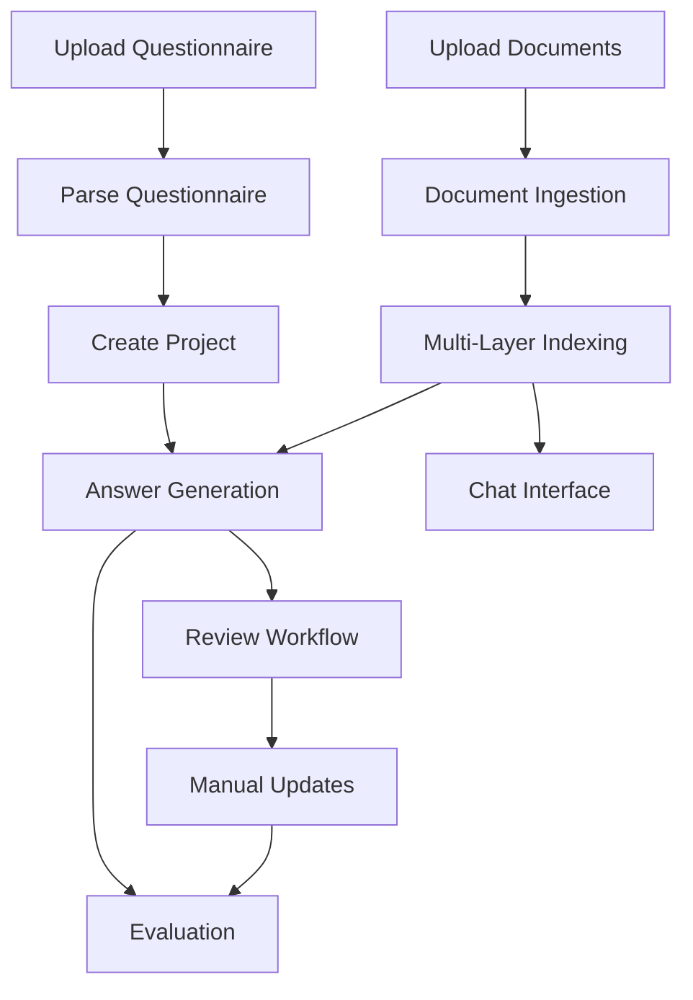

### 1.3 Database Schema & Entity Relationships

#### **Document Entity**
```python
Document:
  - id: UUID
  - filename: string
  - file_type: enum(PDF, DOCX, XLSX, PPTX)
  - upload_timestamp: datetime
  - storage_path: string (object storage reference)
  - indexing_status: enum(PENDING, IN_PROGRESS, COMPLETED, FAILED)
  - metadata: JSON (page count, file size, etc.)
  - checksum: string
```

#### **Project Entity**
```python
Project:
  - id: UUID
  - name: string
  - questionnaire_document_id: UUID (FK to Document)
  - document_scope: enum(ALL_DOCS, SELECTED_DOCS)
  - selected_document_ids: list[UUID] (if SELECTED_DOCS)
  - status: enum(CREATING, READY, OUTDATED, UPDATING, FAILED)
  - created_at: datetime
  - updated_at: datetime
  - configuration: JSON
    - generation_model: string
    - confidence_threshold: float
    - max_citations: int
```

**Status Transitions:**
- `CREATING` → `READY` (project creation complete)
- `READY` → `OUTDATED` (new document indexed when scope=ALL_DOCS)
- `OUTDATED` → `UPDATING` (regeneration triggered)
- `UPDATING` → `READY` (regeneration complete)
- Any → `FAILED` (error occurred)

#### **Section Entity**
```python
Section:
  - id: UUID
  - project_id: UUID (FK to Project)
  - title: string
  - order_index: int
  - parent_section_id: UUID (nullable, for nested sections)
```

#### **Question Entity**
```python
Question:
  - id: UUID
  - section_id: UUID (FK to Section)
  - text: string
  - order_index: int
  - question_type: enum(TEXT, BOOLEAN, NUMERIC, TABLE)
  - metadata: JSON (extracted formatting, sub-questions, etc.)
```

#### **Answer Entity**
```python
Answer:
  - id: UUID
  - question_id: UUID (FK to Question)
  - ai_generated_text: string (nullable)
  - is_answerable: boolean
  - confidence_score: float (0.0-1.0)
  - status: enum(PENDING, GENERATED, CONFIRMED, REJECTED, MANUAL_UPDATED, MISSING_DATA)
  - manual_text: string (nullable, human override)
  - created_at: datetime
  - updated_at: datetime
  - generation_metadata: JSON
    - model_version: string
    - generation_timestamp: datetime
    - tokens_used: int
```

**Status Transitions:**
- `PENDING` → `GENERATED` (AI answer created)
- `GENERATED` → `CONFIRMED` (human approved)
- `GENERATED` → `REJECTED` (human rejected)
- `GENERATED` → `MANUAL_UPDATED` (human edited)
- `GENERATED` → `MISSING_DATA` (marked as unanswerable)
- `MANUAL_UPDATED` → `CONFIRMED` (manual edit approved)

#### **Citation Entity**
```python
Citation:
  - id: UUID
  - answer_id: UUID (FK to Answer)
  - document_id: UUID (FK to Document)
  - chunk_id: string (reference to vector store chunk)
  - page_number: int (nullable)
  - bounding_box: JSON (nullable, {x, y, width, height})
  - excerpt_text: string
  - relevance_score: float
  - order_index: int
```

#### **IndexChunk Entity**
```python
IndexChunk:
  - id: UUID (chunk_id)
  - document_id: UUID (FK to Document)
  - layer: enum(ANSWER_RETRIEVAL, CITATION_DETAIL)
  - chunk_text: string
  - embedding_vector: vector (stored in vector DB)
  - page_number: int (nullable)
  - bounding_box: JSON (nullable)
  - metadata: JSON
    - chunk_strategy: string (semantic, section-based, etc.)
    - parent_chunk_id: UUID (for hierarchical chunking)
```

#### **AsyncRequest Entity**
```python
AsyncRequest:
  - id: UUID
  - request_type: enum(INDEX_DOCUMENT, CREATE_PROJECT, UPDATE_PROJECT, GENERATE_ANSWERS)
  - status: enum(QUEUED, IN_PROGRESS, COMPLETED, FAILED)
  - created_at: datetime
  - started_at: datetime (nullable)
  - completed_at: datetime (nullable)
  - progress_percentage: int (0-100)
  - error_message: string (nullable)
  - result_data: JSON (nullable)
  - related_entity_id: UUID (document_id, project_id, etc.)
```

#### **Evaluation Entity**
```python
Evaluation:
  - id: UUID
  - project_id: UUID (FK to Project)
  - human_answers_document_id: UUID (FK to Document)
  - created_at: datetime
  - overall_score: float
  - metrics: JSON
    - semantic_similarity_avg: float
    - keyword_overlap_avg: float
    - citation_accuracy: float
```

#### **EvaluationResult Entity**
```python
EvaluationResult:
  - id: UUID
  - evaluation_id: UUID (FK to Evaluation)
  - question_id: UUID (FK to Question)
  - ai_answer: string
  - human_answer: string
  - semantic_similarity: float
  - keyword_overlap: float
  - explanation: string
  - matched_keywords: list[string]
  - missing_keywords: list[string]
```

### 1.4 Storage Layout

**Relational Database (PostgreSQL):**
- All entities except embeddings
- Transactional integrity for project/answer updates

**Vector Database (Pinecone/Weaviate/Qdrant):**
- `IndexChunk` embeddings with metadata
- Separate namespaces for ANSWER_RETRIEVAL and CITATION_DETAIL layers

**Object Storage (S3/GCS/Azure Blob):**
- Original uploaded documents
- Parsed intermediate formats (extracted text, tables)
- Generated reports (evaluation PDFs)

---

## 2. Document Ingestion & Indexing

### 2.1 Multi-Format Ingestion Pipeline

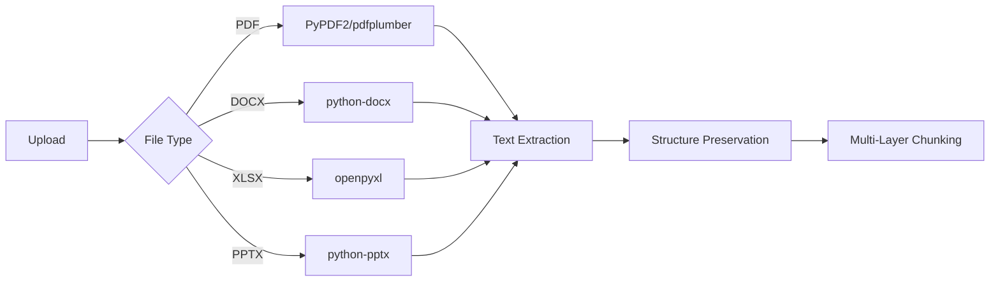

#### **Format-Specific Parsing**

**PDF Processing:**
- Extract text with layout preservation using `pdfplumber`
- Capture bounding boxes for each text block
- Extract tables separately with structure
- Handle scanned PDFs with OCR fallback (Tesseract)

**DOCX Processing:**
- Parse paragraphs, headings, and lists
- Preserve section hierarchy
- Extract tables with cell-level data
- Maintain formatting metadata (bold, italic, etc.)

**XLSX Processing:**
- Parse each sheet as a separate section
- Convert tables to markdown format
- Preserve formulas and cell references
- Handle merged cells appropriately

**PPTX Processing:**
- Extract text from each slide
- Preserve slide titles as section headers
- Extract speaker notes
- Handle embedded tables and charts

### 2.2 Multi-Layer Indexing Strategy

#### **Layer 1: Answer Retrieval (Semantic Sections)**

**Purpose:** Retrieve relevant document sections for answer generation

**Chunking Strategy:**
- **Section-based chunking:** Split by document sections/headings (500-1500 tokens)
- **Semantic chunking:** Use sentence embeddings to group semantically coherent paragraphs
- **Overlap:** 100-token overlap between chunks for context continuity

**Embedding Model:** 
- `text-embedding-3-large` (OpenAI) or `all-MiniLM-L6-v2` (open-source)
- Dimension: 1536 or 384

**Metadata Stored:**
```json
{
  "document_id": "uuid",
  "document_name": "filename.pdf",
  "section_title": "Risk Management",
  "page_range": [5, 7],
  "chunk_type": "semantic_section"
}
```

#### **Layer 2: Citation Detail (Fine-Grained Chunks)**

**Purpose:** Provide precise citations with bounding boxes

**Chunking Strategy:**
- **Paragraph-level chunking:** Each paragraph as a separate chunk (100-300 tokens)
- **Sentence-level for tables:** Each table row or key data point
- **Bounding box capture:** Store exact coordinates for PDF highlighting

**Metadata Stored:**
```json
{
  "document_id": "uuid",
  "page_number": 6,
  "bounding_box": {"x": 72, "y": 450, "width": 450, "height": 120},
  "parent_chunk_id": "layer1_chunk_uuid",
  "chunk_type": "paragraph"
}
```

### 2.3 Indexing Workflow

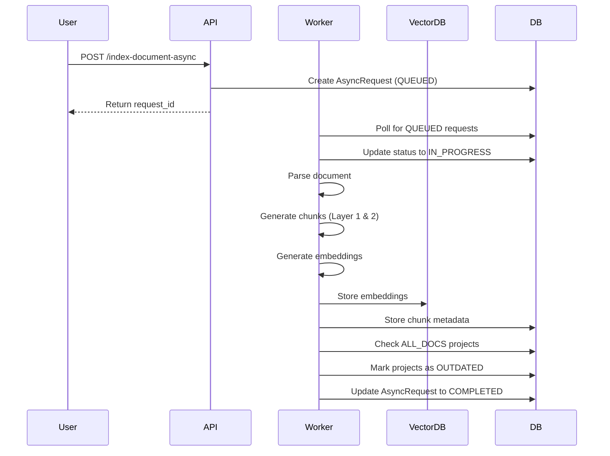

### 2.4 ALL_DOCS Project Invalidation

**Trigger:** When a new document indexing completes

**Logic:**
```python
def on_document_indexed(document_id):
    # Find all projects with ALL_DOCS scope
    projects = db.query(Project).filter(
        Project.document_scope == "ALL_DOCS",
        Project.status == "READY"
    ).all()
    
    for project in projects:
        # Mark as OUTDATED
        project.status = "OUTDATED"
        project.updated_at = datetime.now()
        
        # Optionally trigger auto-regeneration
        if project.configuration.get("auto_regenerate", False):
            trigger_project_update(project.id)
    
    db.commit()
```

---

## 3. Questionnaire Parsing & Project Lifecycle

### 3.1 Questionnaire Parsing

#### **Parsing Strategy**

**PDF Questionnaires:**
1. Extract text with layout analysis
2. Identify sections using heading detection (font size, bold, numbering)
3. Extract questions using pattern matching:
   - Numbered questions (1., 2., a., b., etc.)
   - Bullet points
   - Table rows with question columns
4. Preserve hierarchical structure (sections → subsections → questions)

**DOCX Questionnaires:**
1. Use heading styles (Heading 1, Heading 2) for sections
2. Parse numbered lists as questions
3. Extract tables with question/answer columns

**Example Parsing Output:**
```json
{
  "sections": [
    {
      "title": "I. Organizational Structure",
      "order": 1,
      "subsections": [
        {
          "title": "A. Governance",
          "order": 1,
          "questions": [
            {
              "text": "Describe your governance framework.",
              "order": 1,
              "type": "TEXT"
            }
          ]
        }
      ]
    }
  ]
}
```

### 3.2 Project Creation Workflow

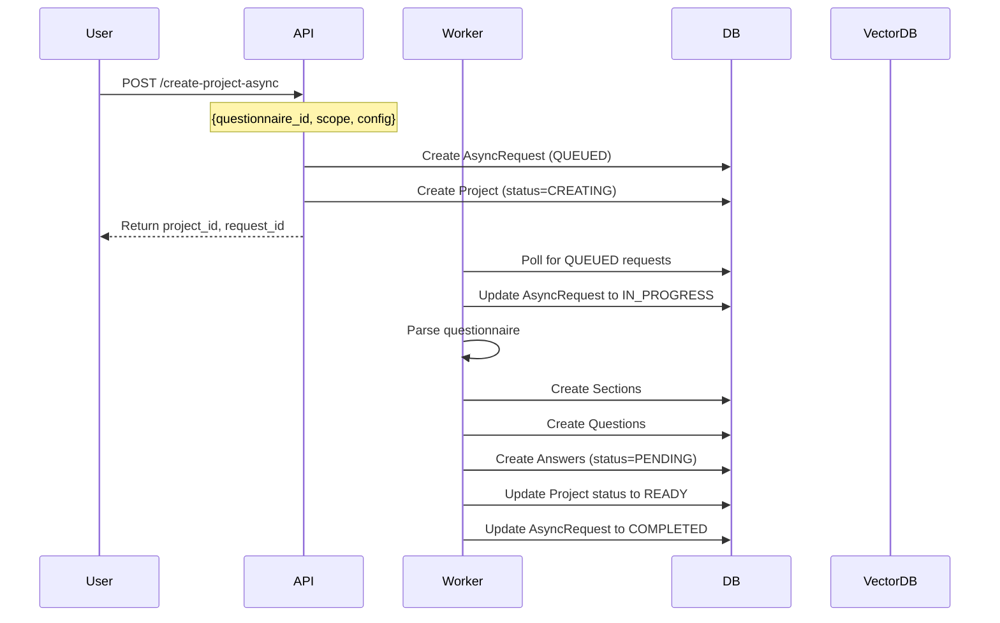

### 3.3 Project Update Workflow

**Trigger Conditions:**
1. Manual user request: `POST /update-project-async`
2. Configuration change (model, threshold, scope)
3. New document indexed (if scope=ALL_DOCS and auto_regenerate=true)

**Update Behavior:**
```python
def update_project(project_id, new_config=None):
    project = db.query(Project).get(project_id)
    
    # Update configuration if provided
    if new_config:
        project.configuration.update(new_config)
    
    # Mark project as UPDATING
    project.status = "UPDATING"
    
    # Regenerate all answers
    answers = db.query(Answer).join(Question).join(Section).filter(
        Section.project_id == project_id
    ).all()
    
    for answer in answers:
        # Preserve manual updates
        if answer.status not in ["MANUAL_UPDATED", "CONFIRMED"]:
            answer.status = "PENDING"
            # Clear AI-generated content
            answer.ai_generated_text = None
            answer.confidence_score = None
            # Clear old citations
            db.query(Citation).filter(Citation.answer_id == answer.id).delete()
    
    # Trigger regeneration
    trigger_answer_generation(project_id)
    
    db.commit()
```

### 3.4 Project Lifecycle States

| Status | Description | User Actions | System Actions |
|--------|-------------|--------------|----------------|
| **CREATING** | Initial project setup in progress | View status | Parse questionnaire, create entities |
| **READY** | Project ready for use | Review answers, regenerate | Monitor for invalidation triggers |
| **OUTDATED** | New documents available | Update project | None (waiting for user/auto-trigger) |
| **UPDATING** | Regeneration in progress | View status | Generate new answers |
| **FAILED** | Error occurred | Retry, view error | Log error details |

---

## 4. Answer Generation with Citations & Confidence

### 4.1 Answer Generation Pipeline

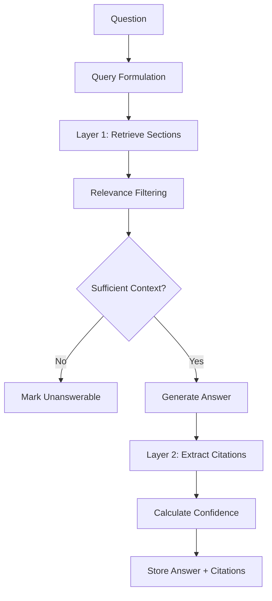

### 4.2 Detailed Generation Process

#### **Step 1: Query Formulation**
```python
def formulate_query(question_text, section_context):
    # Enhance query with section context
    query = f"""
    Section: {section_context.title}
    Question: {question_text}
    
    Find relevant information to answer this due diligence question.
    """
    return query
```

#### **Step 2: Layer 1 Retrieval (Semantic Search)**
```python
def retrieve_relevant_sections(query, project):
    # Get document scope
    if project.document_scope == "ALL_DOCS":
        filter_docs = None
    else:
        filter_docs = project.selected_document_ids
    
    # Vector search in Layer 1
    results = vector_db.search(
        query_embedding=embed(query),
        namespace="answer_retrieval",
        filter={"document_id": {"$in": filter_docs}} if filter_docs else None,
        top_k=10,
        score_threshold=0.7
    )
    
    return results
```

#### **Step 3: Answerability Check**
```python
def check_answerability(question, retrieved_sections):
    # Use LLM to determine if question can be answered
    prompt = f"""
    Question: {question}
    
    Retrieved Context:
    {format_sections(retrieved_sections)}
    
    Can this question be answered using the provided context?
    Respond with: YES or NO
    If NO, explain what information is missing.
    """
    
    response = llm.generate(prompt)
    
    if "NO" in response:
        return False, extract_missing_info(response)
    return True, None
```

#### **Step 4: Answer Generation**
```python
def generate_answer(question, retrieved_sections, config):
    prompt = f"""
    You are answering a due diligence questionnaire using provided reference documents.
    
    Question: {question}
    
    Reference Context:
    {format_sections_with_sources(retrieved_sections)}
    
    Instructions:
    1. Provide a comprehensive answer based ONLY on the reference context
    2. Be specific and cite information accurately
    3. If multiple sources provide relevant info, synthesize them
    4. Do not make assumptions beyond what's stated in the documents
    
    Answer:
    """
    
    answer = llm.generate(
        prompt,
        model=config.generation_model,
        temperature=0.3,  # Lower temperature for factual accuracy
        max_tokens=500
    )
    
    return answer
```

#### **Step 5: Citation Extraction (Layer 2)**
```python
def extract_citations(answer_text, question, retrieved_sections):
    citations = []
    
    for section in retrieved_sections:
        # Get fine-grained chunks from Layer 2
        detail_chunks = vector_db.search(
            query_embedding=embed(answer_text),
            namespace="citation_detail",
            filter={"parent_chunk_id": section.chunk_id},
            top_k=5
        )
        
        for chunk in detail_chunks:
            # Verify chunk is actually used in answer
            if is_chunk_referenced(answer_text, chunk.text):
                citations.append({
                    "document_id": chunk.document_id,
                    "chunk_id": chunk.id,
                    "page_number": chunk.page_number,
                    "bounding_box": chunk.bounding_box,
                    "excerpt_text": chunk.text[:200],
                    "relevance_score": chunk.score
                })
    
    # Rank and limit citations
    citations = sorted(citations, key=lambda x: x["relevance_score"], reverse=True)
    return citations[:config.max_citations]
```

#### **Step 6: Confidence Scoring**
```python
def calculate_confidence(question, answer, citations, retrieved_sections):
    factors = {}
    
    # Factor 1: Retrieval confidence (avg similarity score)
    factors["retrieval_score"] = np.mean([s.score for s in retrieved_sections])
    
    # Factor 2: Citation coverage (how many citations found)
    factors["citation_coverage"] = min(len(citations) / 3, 1.0)  # Expect ~3 citations
    
    # Factor 3: Answer completeness (LLM self-assessment)
    completeness_prompt = f"""
    Question: {question}
    Answer: {answer}
    
    Rate the completeness of this answer on a scale of 0.0 to 1.0.
    Consider: Does it fully address the question? Is it specific enough?
    
    Score (0.0-1.0):
    """
    factors["completeness"] = float(llm.generate(completeness_prompt).strip())
    
    # Factor 4: Consistency check (answer aligns with citations)
    consistency_score = check_answer_citation_consistency(answer, citations)
    factors["consistency"] = consistency_score
    
    # Weighted combination
    confidence = (
        0.3 * factors["retrieval_score"] +
        0.2 * factors["citation_coverage"] +
        0.3 * factors["completeness"] +
        0.2 * factors["consistency"]
    )
    
    return confidence, factors
```

### 4.3 Fallback Behavior

**When No Relevant Documents Found:**
```python
if not retrieved_sections or max_score < 0.5:
    answer = Answer(
        question_id=question.id,
        is_answerable=False,
        ai_generated_text=None,
        confidence_score=0.0,
        status="MISSING_DATA",
        generation_metadata={
            "reason": "No relevant documents found",
            "search_results_count": len(retrieved_sections),
            "max_similarity_score": max_score if retrieved_sections else 0.0
        }
    )
```

### 4.4 Batch Answer Generation

```python
def generate_all_answers(project_id):
    project = db.query(Project).get(project_id)
    questions = get_all_questions(project_id)
    
    for question in questions:
        answer = db.query(Answer).filter(
            Answer.question_id == question.id
        ).first()
        
        # Skip if manually updated or confirmed
        if answer.status in ["MANUAL_UPDATED", "CONFIRMED"]:
            continue
        
        # Generate answer
        result = generate_single_answer(question, project)
        
        # Update answer entity
        answer.ai_generated_text = result.text
        answer.is_answerable = result.is_answerable
        answer.confidence_score = result.confidence
        answer.status = "GENERATED"
        answer.generation_metadata = result.metadata
        
        # Store citations
        for citation_data in result.citations:
            citation = Citation(**citation_data, answer_id=answer.id)
            db.add(citation)
    
    db.commit()
```

---

## 5. Review & Manual Overrides

### 5.1 Review Workflow States

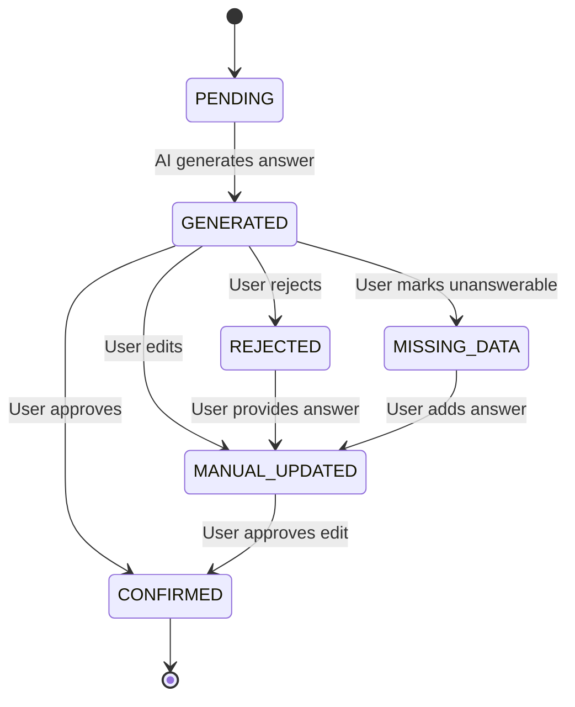

### 5.2 Review Actions & API Endpoints

#### **Confirm Answer**
```python
# POST /update-answer
{
  "answer_id": "uuid",
  "action": "CONFIRM"
}

def confirm_answer(answer_id):
    answer = db.query(Answer).get(answer_id)
    answer.status = "CONFIRMED"
    answer.updated_at = datetime.now()
    db.commit()
```

#### **Reject Answer**
```python
# POST /update-answer
{
  "answer_id": "uuid",
  "action": "REJECT",
  "reason": "Inaccurate information"
}

def reject_answer(answer_id, reason):
    answer = db.query(Answer).get(answer_id)
    answer.status = "REJECTED"
    answer.generation_metadata["rejection_reason"] = reason
    answer.updated_at = datetime.now()
    db.commit()
```

#### **Manual Update**
```python
# POST /update-answer
{
  "answer_id": "uuid",
  "action": "MANUAL_UPDATE",
  "manual_text": "Corrected answer text..."
}

def manual_update_answer(answer_id, manual_text):
    answer = db.query(Answer).get(answer_id)
    
    # Preserve AI answer for comparison
    answer.manual_text = manual_text
    answer.status = "MANUAL_UPDATED"
    answer.updated_at = datetime.now()
    
    db.commit()
```

#### **Mark as Missing Data**
```python
# POST /update-answer
{
  "answer_id": "uuid",
  "action": "MISSING_DATA",
  "notes": "Information not available in current documents"
}

def mark_missing_data(answer_id, notes):
    answer = db.query(Answer).get(answer_id)
    answer.status = "MISSING_DATA"
    answer.is_answerable = False
    answer.generation_metadata["missing_data_notes"] = notes
    answer.updated_at = datetime.now()
    db.commit()
```

### 5.3 Dual Answer Storage

**Purpose:** Preserve both AI and human answers for evaluation and audit

**Storage Pattern:**
```python
class Answer:
    # AI-generated content
    ai_generated_text: str | None
    confidence_score: float | None
    
    # Human-provided content
    manual_text: str | None
    
    # Status indicates which is active
    status: AnswerStatus
    
    def get_active_answer(self) -> str:
        """Return the answer that should be used"""
        if self.status == "MANUAL_UPDATED":
            return self.manual_text
        elif self.status in ["CONFIRMED", "GENERATED"]:
            return self.ai_generated_text
        else:
            return None
```

### 5.4 Review Dashboard Data

**GET /get-project-info Response:**
```json
{
  "project_id": "uuid",
  "name": "Q1 2024 Due Diligence",
  "status": "READY",
  "statistics": {
    "total_questions": 150,
    "answered": 120,
    "pending": 10,
    "confirmed": 80,
    "manual_updated": 25,
    "rejected": 5,
    "missing_data": 10,
    "avg_confidence": 0.78
  },
  "sections": [
    {
      "section_id": "uuid",
      "title": "Organizational Structure",
      "questions_count": 25,
      "completion_rate": 0.88
    }
  ]
}
```

---

## 6. Evaluation Framework

### 6.1 Evaluation Workflow

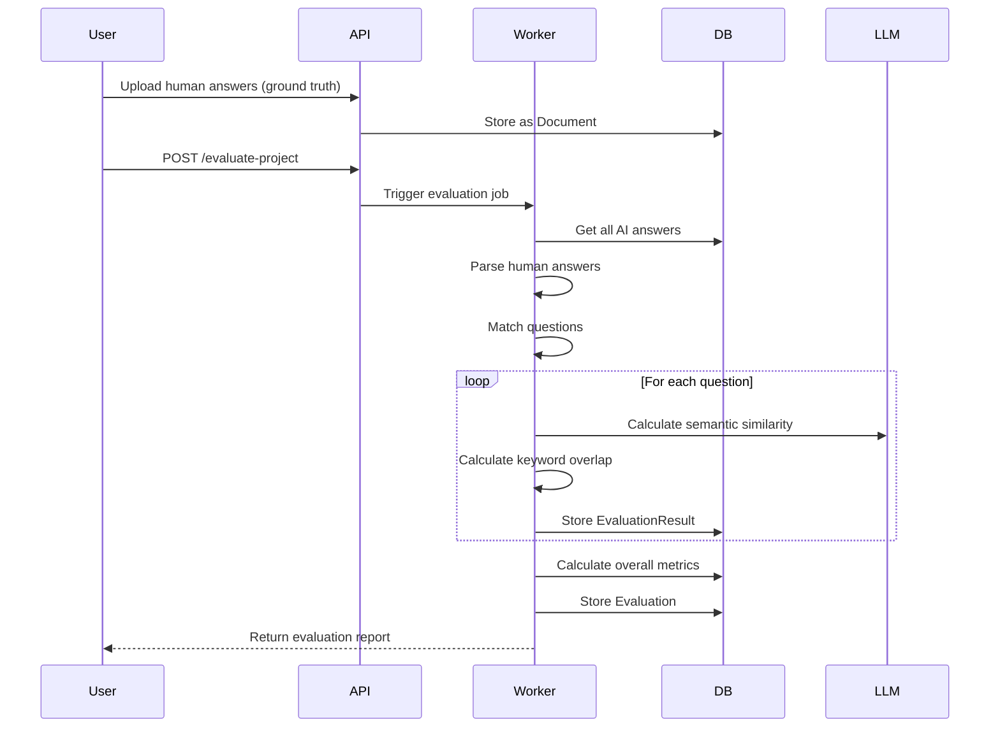

### 6.2 Similarity Metrics

#### **Semantic Similarity**
```python
def calculate_semantic_similarity(ai_answer, human_answer):
    # Use sentence embeddings
    ai_embedding = embed(ai_answer)
    human_embedding = embed(human_answer)
    
    # Cosine similarity
    similarity = cosine_similarity(ai_embedding, human_embedding)
    
    return similarity
```

#### **Keyword Overlap**
```python
def calculate_keyword_overlap(ai_answer, human_answer):
    # Extract key terms (nouns, named entities)
    ai_keywords = extract_keywords(ai_answer)
    human_keywords = extract_keywords(human_answer)
    
    # Jaccard similarity
    intersection = set(ai_keywords) & set(human_keywords)
    union = set(ai_keywords) | set(human_keywords)
    
    overlap = len(intersection) / len(union) if union else 0.0
    
    return {
        "score": overlap,
        "matched_keywords": list(intersection),
        "missing_keywords": list(set(human_keywords) - set(ai_keywords)),
        "extra_keywords": list(set(ai_keywords) - set(human_keywords))
    }
```

#### **Citation Accuracy**
```python
def evaluate_citation_accuracy(answer_id, human_answer):
    citations = db.query(Citation).filter(Citation.answer_id == answer_id).all()
    
    if not citations:
        return 0.0
    
    # Check if cited information appears in human answer
    accurate_citations = 0
    for citation in citations:
        # Extract key facts from citation
        citation_facts = extract_facts(citation.excerpt_text)
        human_facts = extract_facts(human_answer)
        
        # Check overlap
        if has_significant_overlap(citation_facts, human_facts):
            accurate_citations += 1
    
    return accurate_citations / len(citations)
```

### 6.3 Evaluation Metrics

**Overall Evaluation Scores:**
```python
class EvaluationMetrics:
    semantic_similarity_avg: float  # 0.0-1.0
    keyword_overlap_avg: float      # 0.0-1.0
    citation_accuracy: float         # 0.0-1.0
    
    # Composite score
    overall_score = (
        0.5 * semantic_similarity_avg +
        0.3 * keyword_overlap_avg +
        0.2 * citation_accuracy
    )
```

**Per-Question Evaluation:**
```python
class EvaluationResult:
    question_id: UUID
    ai_answer: str
    human_answer: str
    semantic_similarity: float
    keyword_overlap: float
    explanation: str  # LLM-generated comparison
    matched_keywords: list[str]
    missing_keywords: list[str]
```

### 6.4 Evaluation Report Generation

```python
def generate_evaluation_report(evaluation_id):
    evaluation = db.query(Evaluation).get(evaluation_id)
    results = db.query(EvaluationResult).filter(
        EvaluationResult.evaluation_id == evaluation_id
    ).all()
    
    report = {
        "evaluation_id": evaluation_id,
        "project_id": evaluation.project_id,
        "overall_metrics": {
            "semantic_similarity": evaluation.metrics["semantic_similarity_avg"],
            "keyword_overlap": evaluation.metrics["keyword_overlap_avg"],
            "citation_accuracy": evaluation.metrics["citation_accuracy"],
            "overall_score": evaluation.overall_score
        },
        "question_breakdown": [
            {
                "question": result.question.text,
                "semantic_similarity": result.semantic_similarity,
                "keyword_overlap": result.keyword_overlap,
                "matched_keywords": result.matched_keywords,
                "missing_keywords": result.missing_keywords,
                "explanation": result.explanation
            }
            for result in results
        ],
        "top_performers": get_top_questions(results, n=10),
        "needs_improvement": get_bottom_questions(results, n=10)
    }
    
    return report
```

### 6.5 LLM-Based Qualitative Comparison

```python
def generate_comparison_explanation(question, ai_answer, human_answer):
    prompt = f"""
    Compare the following AI-generated and human-written answers to a due diligence question.
    
    Question: {question}
    
    AI Answer: {ai_answer}
    
    Human Answer: {human_answer}
    
    Provide a brief analysis:
    1. What key points does the AI answer capture correctly?
    2. What important information is missing from the AI answer?
    3. Are there any inaccuracies in the AI answer?
    4. Overall assessment (2-3 sentences)
    """
    
    explanation = llm.generate(prompt, max_tokens=300)
    return explanation
```

---

## 7. Optional Chat Extension

### 7.1 Chat Architecture

**Purpose:** Allow users to ask ad-hoc questions about the document corpus using the same indexed data

**Key Constraints:**
- Uses same vector database and indexing layers
- Does NOT interfere with questionnaire projects
- Provides citations like answer generation
- Maintains conversation context

### 7.2 Chat Data Model

```python
ChatSession:
  - id: UUID
  - user_id: UUID
  - document_scope: enum(ALL_DOCS, SELECTED_DOCS)
  - selected_document_ids: list[UUID]
  - created_at: datetime
  - title: string (auto-generated from first message)

ChatMessage:
  - id: UUID
  - session_id: UUID (FK to ChatSession)
  - role: enum(USER, ASSISTANT)
  - content: string
  - timestamp: datetime
  - citations: list[Citation] (for assistant messages)
  - confidence_score: float (for assistant messages)
```

### 7.3 Chat Workflow

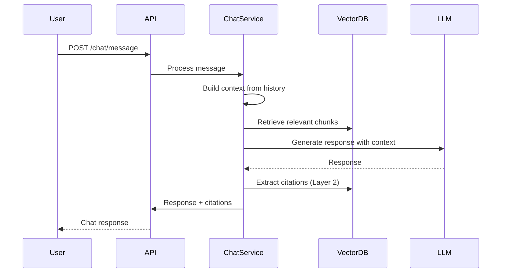

### 7.4 Chat Implementation

```python
def process_chat_message(session_id, user_message):
    session = db.query(ChatSession).get(session_id)
    
    # Get conversation history
    history = db.query(ChatMessage).filter(
        ChatMessage.session_id == session_id
    ).order_by(ChatMessage.timestamp).limit(10).all()
    
    # Retrieve relevant context
    retrieved_chunks = retrieve_relevant_sections(
        query=user_message,
        document_scope=session.document_scope,
        selected_docs=session.selected_document_ids
    )
    
    # Build prompt with history and context
    prompt = build_chat_prompt(history, user_message, retrieved_chunks)
    
    # Generate response
    response = llm.generate(prompt)
    
    # Extract citations
    citations = extract_citations(response, user_message, retrieved_chunks)
    
    # Calculate confidence
    confidence = calculate_confidence(user_message, response, citations, retrieved_chunks)
    
    # Store messages
    user_msg = ChatMessage(
        session_id=session_id,
        role="USER",
        content=user_message,
        timestamp=datetime.now()
    )
    
    assistant_msg = ChatMessage(
        session_id=session_id,
        role="ASSISTANT",
        content=response,
        citations=citations,
        confidence_score=confidence,
        timestamp=datetime.now()
    )
    
    db.add_all([user_msg, assistant_msg])
    db.commit()
    
    return assistant_msg
```

### 7.5 Separation from Questionnaire Flow

**Isolation Mechanisms:**
1. **Separate API endpoints:** `/chat/*` vs `/projects/*`
2. **Independent data models:** No foreign keys between Chat and Project entities
3. **Shared read-only resources:** Both use same vector DB (read-only for chat)
4. **No state interference:** Chat sessions don't affect project status

---

## 8. Frontend Experience (High-Level)

### 8.1 Screen Definitions

#### **1. Project List Screen**

**Purpose:** View all questionnaire projects and their status

**Components:**
- Project cards with:
  - Project name
  - Status badge (READY, OUTDATED, UPDATING, etc.)
  - Progress metrics (% answered, % confirmed)
  - Last updated timestamp
- Filters: Status, date range
- Actions: Create new project, delete project

**Data Source:** `GET /get-all-projects`

---

#### **2. Project Detail Screen**

**Purpose:** View sections, questions, and answers for a specific project

**Layout:**
```
┌─────────────────────────────────────────────┐
│ Project: Q1 2024 Due Diligence              │
│ Status: READY  |  Progress: 85/100 answered │
├─────────────────────────────────────────────┤
│ Sections (Sidebar)                          │
│ ├─ I. Organizational Structure (12/15) ✓   │
│ ├─ II. Risk Management (20/25)             │
│ └─ III. Compliance (15/20)                  │
├─────────────────────────────────────────────┤
│ Questions (Main Panel)                      │
│ ┌───────────────────────────────────────┐   │
│ │ Q1: Describe governance framework     │   │
│ │ Status: CONFIRMED  Confidence: 0.87   │   │
│ │ [View Answer] [Edit]                  │   │
│ └───────────────────────────────────────┘   │
│ ┌───────────────────────────────────────┐   │
│ │ Q2: What is your risk appetite?       │   │
│ │ Status: GENERATED  Confidence: 0.65   │   │
│ │ [Review] [Edit]                       │   │
│ └───────────────────────────────────────┘   │
└─────────────────────────────────────────────┘
```

**Data Source:** `GET /get-project-info/{project_id}`

---

#### **3. Question Review Screen**

**Purpose:** Review and approve/edit individual answers

**Components:**
- Question text (read-only)
- AI-generated answer with:
  - Confidence score visualization
  - Citations list (clickable to view source)
  - Answerability indicator
- Review actions:
  - ✓ Confirm
  - ✗ Reject
  - ✏️ Edit manually
  - ⚠️ Mark as missing data
- Side panel: Citation preview with document viewer
- Navigation: Previous/Next question

**Interaction Flow:**
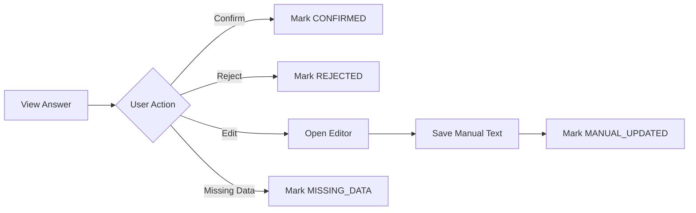

**Data Source:** `GET /get-answer/{answer_id}`
**Actions:** `POST /update-answer`

---

#### **4. Document Management Screen**

**Purpose:** Upload, view, and manage reference documents

**Components:**
- Document list table:
  - Filename
  - File type
  - Upload date
  - Indexing status (PENDING, IN_PROGRESS, COMPLETED, FAILED)
  - Actions (delete, re-index)
- Upload area (drag-and-drop)
- Indexing status tracker (real-time updates)
- Document scope selector (for project creation)

**Interaction Flow:**
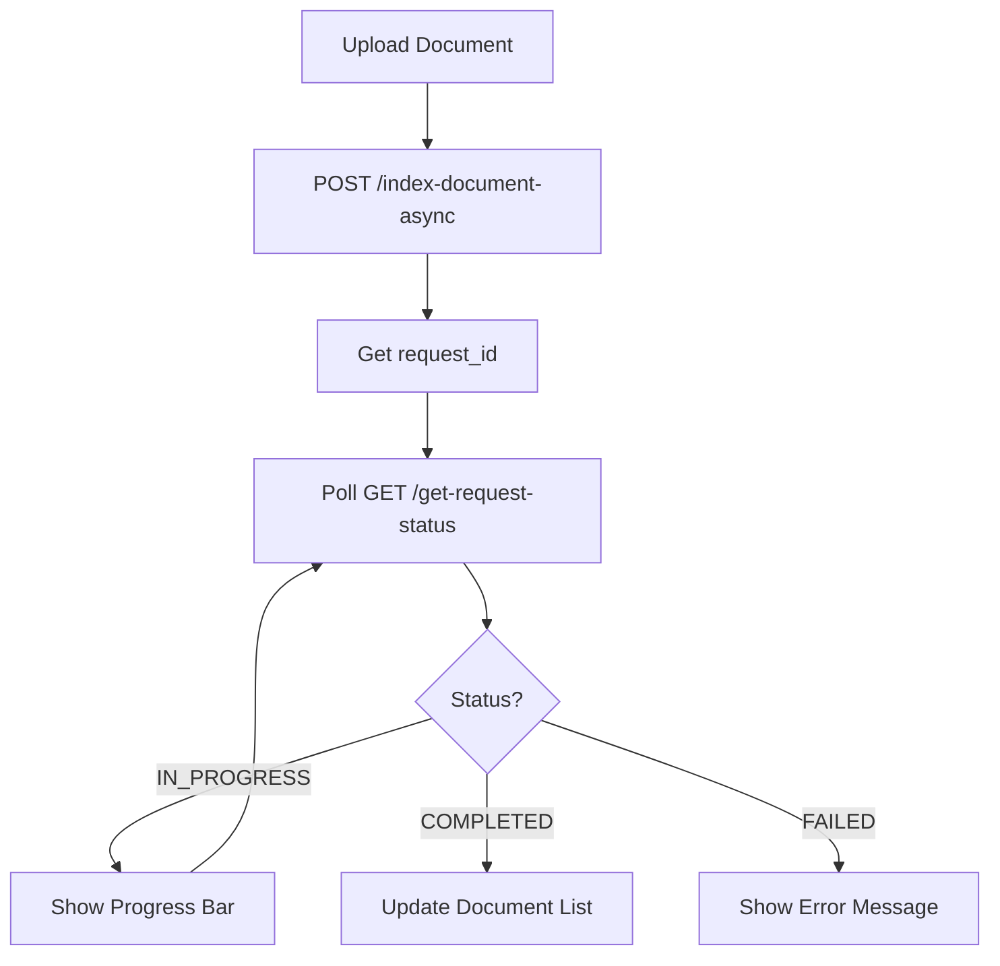

**Data Sources:**
- `GET /get-all-documents`
- `POST /index-document-async`
- `GET /get-request-status/{request_id}`

---

#### **5. Evaluation Report Screen**

**Purpose:** Compare AI-generated answers to human ground truth

**Components:**
- Overall metrics dashboard:
  - Semantic similarity score
  - Keyword overlap score
  - Citation accuracy
  - Overall composite score
- Question-by-question comparison table:
  - Question text
  - Similarity scores
  - Matched/missing keywords
  - Explanation (expandable)
- Filters: Sort by score, filter by threshold
- Export: Download PDF report

**Layout:**
```
┌─────────────────────────────────────────────┐
│ Evaluation Report: Q1 2024 vs Ground Truth │
├─────────────────────────────────────────────┤
│ Overall Metrics                             │
│ ┌─────────────┬─────────────┬─────────────┐ │
│ │ Semantic    │ Keyword     │ Citation    │ │
│ │ Similarity  │ Overlap     │ Accuracy    │ │
│ │   0.82      │   0.75      │   0.88      │ │
│ └─────────────┴─────────────┴─────────────┘ │
│                                             │
│ Question Breakdown                          │
│ ┌───────────────────────────────────────┐   │
│ │ Q: Describe governance framework      │   │
│ │ Similarity: 0.91  Overlap: 0.85       │   │
│ │ Matched: [governance, board, audit]   │   │
│ │ Missing: [committee structure]        │   │
│ │ [View Comparison]                     │   │
│ └───────────────────────────────────────┘   │
└─────────────────────────────────────────────┘
```

**Data Source:** `GET /get-evaluation/{evaluation_id}`

---

#### **6. Request Status Screen**

**Purpose:** Track async operations (indexing, project creation, answer generation)

**Components:**
- Active requests list:
  - Request type
  - Status (QUEUED, IN_PROGRESS, COMPLETED, FAILED)
  - Progress percentage
  - Started/completed timestamps
  - Error messages (if failed)
- Auto-refresh (polling every 2 seconds)
- Notification system for completed requests

**Data Source:** `GET /get-request-status/{request_id}`

---

### 8.2 User Workflows

#### **Workflow 1: Create New Project**

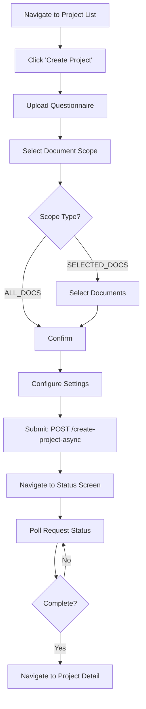

**Steps:**
1. User clicks "Create Project" button
2. Modal opens with questionnaire upload
3. User selects document scope (ALL_DOCS or specific documents)
4. User configures generation settings (model, confidence threshold)
5. System creates project asynchronously
6. User monitors status on Request Status screen
7. Upon completion, user navigates to Project Detail screen

---

#### **Workflow 2: Review Answers**

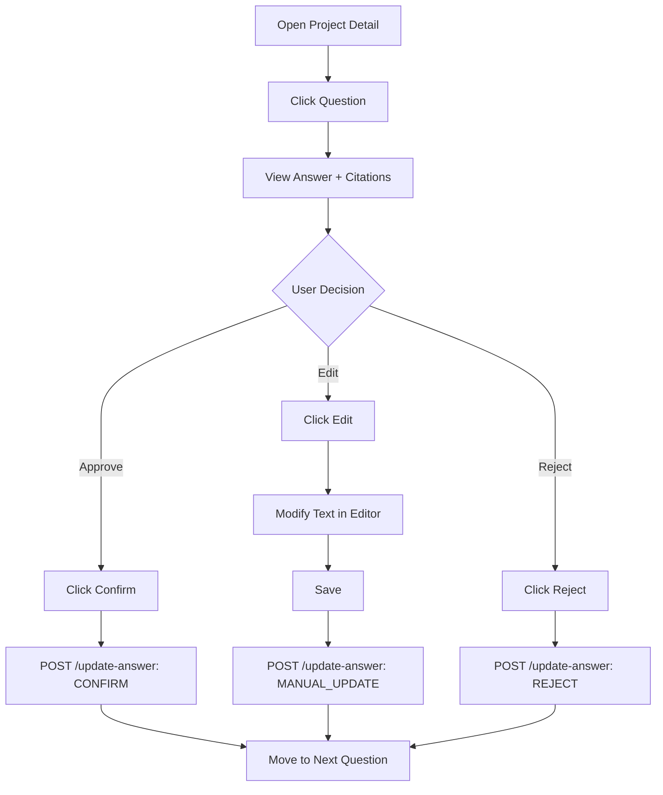

**Steps:**
1. User navigates to Project Detail screen
2. User clicks on a question to review
3. Question Review screen opens with answer and citations
4. User reviews answer quality and citations
5. User takes action:
   - **Confirm:** Approves AI answer
   - **Edit:** Makes manual corrections
   - **Reject:** Marks answer as incorrect
   - **Missing Data:** Indicates information not available
6. System updates answer status
7. User proceeds to next question

---

#### **Workflow 3: Track Background Status**

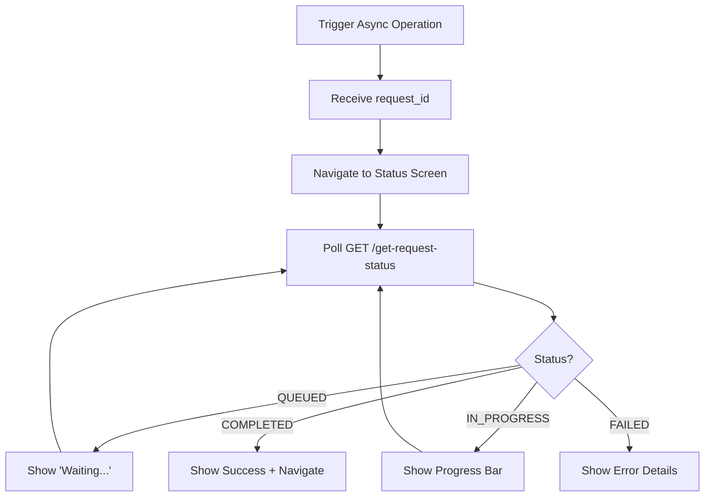

**Steps:**
1. User triggers async operation (index document, create project, etc.)
2. System returns `request_id`
3. UI navigates to Request Status screen or shows inline status
4. Frontend polls `/get-request-status/{request_id}` every 2 seconds
5. UI updates based on status:
   - **QUEUED:** Show waiting indicator
   - **IN_PROGRESS:** Show progress bar with percentage
   - **COMPLETED:** Show success message and navigate to result
   - **FAILED:** Show error message with details
6. User can cancel monitoring or navigate away (status persists)

---

#### **Workflow 4: Compare AI vs Human Answers**

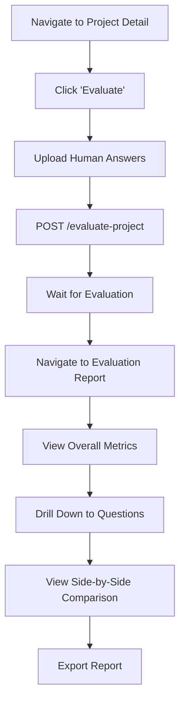

**Steps:**
1. User opens project they want to evaluate
2. User clicks "Evaluate" button
3. User uploads document with human-written answers (ground truth)
4. System processes evaluation asynchronously
5. User navigates to Evaluation Report screen
6. User reviews overall metrics and question-by-question breakdown
7. User can drill down to see detailed comparisons
8. User exports report as PDF for sharing

---

### 8.3 UI/UX Considerations

**Real-Time Updates:**
- Use WebSocket or polling for async operation status
- Show progress indicators for long-running tasks
- Provide notifications when background tasks complete

**Error Handling:**
- Display user-friendly error messages
- Provide retry options for failed operations
- Show validation errors inline on forms

**Responsive Design:**
- Mobile-friendly layouts for review workflows
- Collapsible sidebars for document/section navigation
- Keyboard shortcuts for power users (next question, confirm, etc.)

**Performance:**
- Lazy load questions (paginate or virtual scroll)
- Cache project data to reduce API calls
- Optimize document viewer for large PDFs

**Accessibility:**
- ARIA labels for screen readers
- Keyboard navigation support
- High contrast mode for citations

---

## Component Boundaries & Data Flow

### System Architecture Diagram

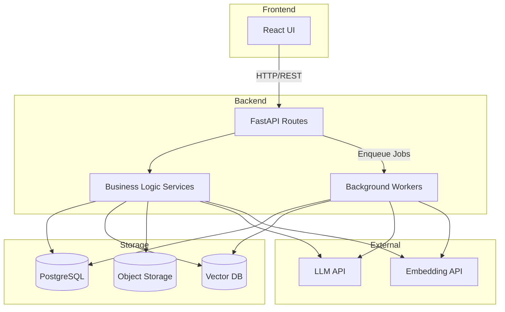

### API Endpoint Summary

| Endpoint | Method | Purpose | Async? |
|----------|--------|---------|--------|
| `/index-document-async` | POST | Upload and index document | Yes |
| `/create-project-async` | POST | Create questionnaire project | Yes |
| `/update-project-async` | POST | Regenerate project answers | Yes |
| `/generate-single-answer` | POST | Generate one answer | No |
| `/generate-all-answers` | POST | Generate all project answers | Yes |
| `/update-answer` | POST | Confirm/reject/edit answer | No |
| `/get-project-info` | GET | Get project details | No |
| `/get-project-status` | GET | Get project status | No |
| `/get-request-status` | GET | Get async request status | No |
| `/get-answer` | GET | Get answer with citations | No |
| `/get-all-documents` | GET | List all documents | No |
| `/evaluate-project` | POST | Compare AI vs human answers | Yes |
| `/get-evaluation` | GET | Get evaluation report | No |

---

## Non-Functional Requirements

### Async Processing
- All long-running operations (>5 seconds) are async
- Background workers process queued requests
- Status tracking via `AsyncRequest` entity
- Progress updates for user feedback

### Error Handling
- Graceful degradation when documents can't be parsed
- Retry logic for transient failures (API rate limits)
- Detailed error messages in `AsyncRequest.error_message`
- Fallback to "unanswerable" when retrieval fails

### Scalability
- Horizontal scaling of background workers
- Vector DB sharding by document collection
- Object storage for large files
- Database connection pooling

### Security
- Authentication/authorization (JWT tokens)
- Document access control (user/project scoping)
- Input validation and sanitization
- Rate limiting on API endpoints

### Observability
- Structured logging (request IDs, user IDs)
- Metrics: answer generation latency, confidence distribution
- Alerts: indexing failures, low confidence answers
- Audit trail: all answer updates logged

---

## Summary

This architecture provides:

✅ **Complete data flow:** Upload → Index → Parse → Generate → Review → Evaluate  
✅ **Robust answer generation:** Answerability check + citations + confidence scoring  
✅ **Project lifecycle management:** Status transitions, auto-invalidation, regeneration  
✅ **Review workflow:** Preserve AI + human answers, multiple status states  
✅ **Evaluation framework:** Semantic similarity + keyword overlap + qualitative analysis  
✅ **Async processing:** Background workers with status tracking  
✅ **Frontend UX:** 6 core screens covering all user workflows  
✅ **Extensibility:** Optional chat interface using same infrastructure
