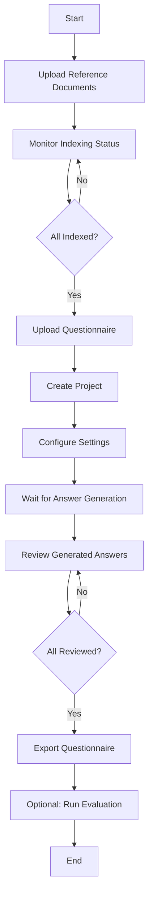
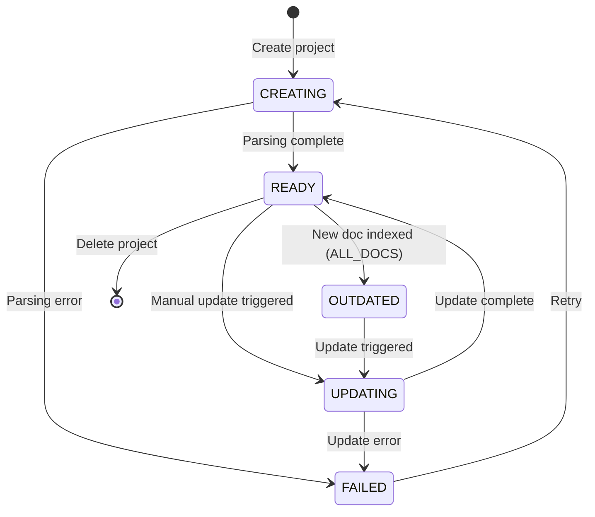
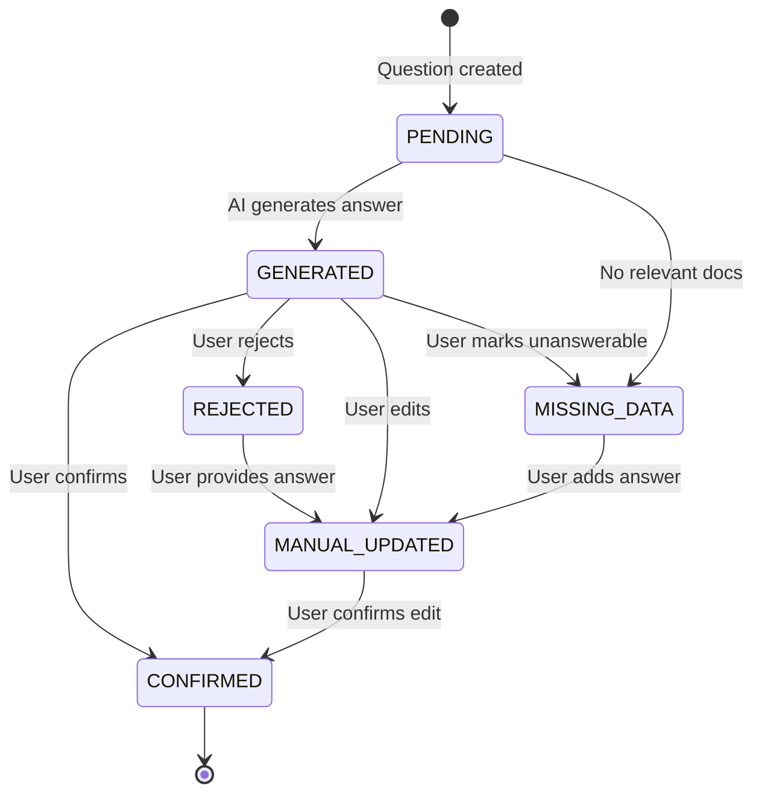
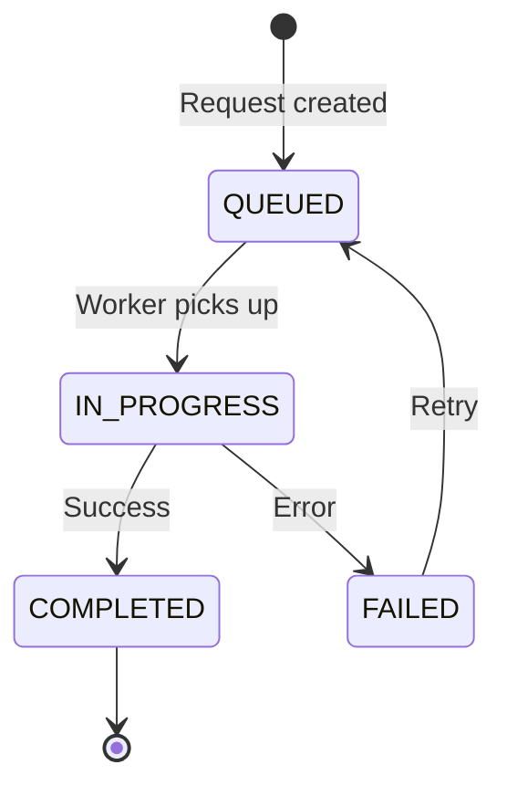

# Functional Design Document
## Due Diligence Questionnaire Agent System

---

## 1. User Flows

### 1.1 Complete End-to-End Workflow



### 1.2 Document Upload & Indexing Flow

**Actors:** User, System

**Preconditions:** User has reference documents (PDF, DOCX, XLSX, PPTX)

**Steps:**
1. User navigates to Document Management screen
2. User drags and drops files or clicks "Upload"
3. System validates file types and sizes
4. System uploads files to object storage
5. System creates `Document` records with status=PENDING
6. System enqueues indexing jobs (returns `request_id` for each)
7. User sees documents in list with "Indexing..." status
8. Background worker processes each document:
   - Parses content based on file type
   - Generates chunks (Layer 1 & 2)
   - Creates embeddings
   - Stores in vector database
9. System updates document status to COMPLETED
10. System checks for ALL_DOCS projects and marks them OUTDATED
11. User receives notification "Indexing complete"

**Postconditions:** 
- Documents are indexed and searchable
- ALL_DOCS projects are marked OUTDATED

**Error Cases:**
- Unsupported file type → Show error, reject upload
- Parsing failure → Mark document status=FAILED, show error details
- Embedding API failure → Retry 3 times, then mark FAILED

---

### 1.3 Project Creation Flow

**Actors:** User, System

**Preconditions:** At least one document is indexed

**Steps:**
1. User clicks "Create Project" on Project List screen
2. Modal opens with form:
   - Project name (text input)
   - Questionnaire upload (file picker)
   - Document scope (radio: ALL_DOCS / SELECTED_DOCS)
   - If SELECTED_DOCS: Multi-select document list
   - Configuration:
     - Generation model (dropdown)
     - Confidence threshold (slider: 0.0-1.0)
     - Max citations per answer (number input)
3. User fills form and clicks "Create"
4. System validates inputs:
   - Questionnaire file is valid
   - At least one document selected (if SELECTED_DOCS)
5. System calls `POST /create-project-async`
6. API creates `Project` record (status=CREATING)
7. API creates `AsyncRequest` record (status=QUEUED)
8. API returns `{project_id, request_id}`
9. UI navigates to Request Status screen
10. Background worker:
    - Parses questionnaire into sections and questions
    - Creates `Section` and `Question` records
    - Creates `Answer` records (status=PENDING)
    - Updates project status to READY
11. User sees "Project created successfully"
12. User clicks "View Project" → navigates to Project Detail screen

**Postconditions:**
- Project exists with all questions parsed
- Answers are in PENDING state (ready for generation)

**Error Cases:**
- Questionnaire parsing fails → Mark project FAILED, show error
- No questions found → Mark project FAILED, suggest manual review
- Database error → Rollback transaction, show error

---

### 1.4 Answer Generation Flow

**Actors:** User, System

**Preconditions:** Project exists with PENDING answers

**Steps:**
1. User opens Project Detail screen
2. User clicks "Generate All Answers"
3. System calls `POST /generate-all-answers`
4. API creates `AsyncRequest` (type=GENERATE_ANSWERS)
5. Background worker processes each question:
   - Retrieves relevant document sections (Layer 1)
   - Checks answerability
   - If answerable:
     - Generates answer using LLM
     - Extracts citations (Layer 2)
     - Calculates confidence score
     - Updates answer (status=GENERATED)
   - If not answerable:
     - Updates answer (status=MISSING_DATA, is_answerable=False)
6. Worker updates progress percentage
7. UI polls status and shows progress bar
8. Upon completion, UI refreshes project data
9. User sees answers with confidence scores

**Alternative Flow: Single Answer Generation**
- User clicks "Regenerate" on specific question
- System calls `POST /generate-single-answer`
- Synchronous response (no async request)
- UI updates answer immediately

**Postconditions:**
- All answers have status=GENERATED or MISSING_DATA
- Citations are stored and linked to answers

**Error Cases:**
- LLM API failure → Retry 3 times, then mark answer FAILED
- No relevant documents → Mark answer MISSING_DATA
- Timeout (>60s per question) → Mark FAILED, log error

---

### 1.5 Answer Review Flow

**Actors:** User

**Preconditions:** Answers are GENERATED

**Steps:**
1. User opens Project Detail screen
2. User clicks on a question to review
3. Question Review screen opens showing:
   - Question text
   - AI-generated answer
   - Confidence score (color-coded: green >0.8, yellow 0.5-0.8, red <0.5)
   - Citations list with excerpts
4. User reviews answer quality
5. User takes action:

**Action A: Confirm**
- User clicks "Confirm" button
- System calls `POST /update-answer` with action=CONFIRM
- Answer status → CONFIRMED
- UI shows green checkmark

**Action B: Edit**
- User clicks "Edit" button
- Text editor opens with AI answer pre-filled
- User modifies text
- User clicks "Save"
- System calls `POST /update-answer` with action=MANUAL_UPDATE
- Answer status → MANUAL_UPDATED
- Both AI and manual text are preserved

**Action C: Reject**
- User clicks "Reject" button
- Modal asks for rejection reason
- User enters reason and confirms
- System calls `POST /update-answer` with action=REJECT
- Answer status → REJECTED

**Action D: Mark Missing Data**
- User clicks "Missing Data" button
- Modal asks for notes
- User enters notes and confirms
- System calls `POST /update-answer` with action=MISSING_DATA
- Answer status → MISSING_DATA

6. UI navigates to next question automatically

**Postconditions:**
- Answer has final status (CONFIRMED, MANUAL_UPDATED, REJECTED, or MISSING_DATA)
- Manual edits are preserved alongside AI answers

---

### 1.6 Project Update Flow

**Actors:** User, System

**Preconditions:** Project status is OUTDATED or user wants to regenerate

**Steps:**
1. User sees "OUTDATED" badge on project
2. User clicks "Update Project"
3. Modal shows:
   - Reason for update (e.g., "New documents indexed")
   - Option to change configuration
   - Warning: "This will regenerate all non-confirmed answers"
4. User confirms
5. System calls `POST /update-project-async`
6. API updates project status to UPDATING
7. Background worker:
   - Resets GENERATED answers to PENDING
   - Preserves CONFIRMED and MANUAL_UPDATED answers
   - Deletes old citations for regenerated answers
   - Regenerates PENDING answers
8. Project status → READY
9. User receives notification "Project updated"

**Postconditions:**
- Answers reflect latest document corpus
- Manual edits are preserved

---

### 1.7 Evaluation Flow

**Actors:** User, System

**Preconditions:** Project has GENERATED answers, user has human ground truth

**Steps:**
1. User opens Project Detail screen
2. User clicks "Evaluate" button
3. Modal prompts for human answers upload
4. User uploads document with ground truth answers
5. System calls `POST /evaluate-project`
6. Background worker:
   - Parses human answers
   - Matches questions by text similarity
   - For each matched question:
     - Calculates semantic similarity
     - Calculates keyword overlap
     - Generates qualitative explanation
     - Stores `EvaluationResult`
   - Calculates overall metrics
   - Stores `Evaluation` record
7. User navigates to Evaluation Report screen
8. User views:
   - Overall scores (dashboard)
   - Question-by-question breakdown
   - Side-by-side comparisons
9. User exports report as PDF

**Postconditions:**
- Evaluation results are stored
- User has quantitative and qualitative comparison

---

## 2. API Behaviors

### 2.1 POST /index-document-async

**Purpose:** Upload and index a reference document

**Request:**
```json
{
  "file": "<multipart file>",
  "metadata": {
    "source": "Internal audit 2024",
    "category": "Compliance"
  }
}
```

**Response:**
```json
{
  "document_id": "uuid",
  "request_id": "uuid",
  "status": "QUEUED"
}
```

**Behavior:**
1. Validate file type (PDF, DOCX, XLSX, PPTX)
2. Upload to object storage
3. Create `Document` record (status=PENDING)
4. Create `AsyncRequest` record
5. Enqueue indexing job
6. Return IDs immediately

**Side Effects:**
- ALL_DOCS projects marked OUTDATED upon completion

---

### 2.2 POST /create-project-async

**Purpose:** Create a new questionnaire project

**Request:**
```json
{
  "name": "Q1 2024 Due Diligence",
  "questionnaire_document_id": "uuid",
  "document_scope": "ALL_DOCS",
  "selected_document_ids": [],
  "configuration": {
    "generation_model": "gpt-4",
    "confidence_threshold": 0.7,
    "max_citations": 5
  }
}
```

**Response:**
```json
{
  "project_id": "uuid",
  "request_id": "uuid",
  "status": "CREATING"
}
```

**Behavior:**
1. Validate questionnaire document exists
2. Validate document scope and selected documents
3. Create `Project` record (status=CREATING)
4. Create `AsyncRequest` record
5. Enqueue project creation job
6. Return IDs immediately

**Background Processing:**
- Parse questionnaire
- Create sections and questions
- Create pending answers
- Update project status to READY

---

### 2.3 POST /generate-all-answers

**Purpose:** Generate AI answers for all pending questions

**Request:**
```json
{
  "project_id": "uuid"
}
```

**Response:**
```json
{
  "request_id": "uuid",
  "status": "QUEUED",
  "total_questions": 150
}
```

**Behavior:**
1. Validate project exists and is READY
2. Create `AsyncRequest` record
3. Enqueue answer generation job
4. Return request ID

**Background Processing:**
- For each PENDING answer:
  - Retrieve relevant sections
  - Check answerability
  - Generate answer + citations
  - Calculate confidence
  - Update answer record

---

### 2.4 POST /generate-single-answer

**Purpose:** Generate answer for a single question (synchronous)

**Request:**
```json
{
  "question_id": "uuid"
}
```

**Response:**
```json
{
  "answer_id": "uuid",
  "ai_generated_text": "The company follows a three-tier governance model...",
  "is_answerable": true,
  "confidence_score": 0.85,
  "citations": [
    {
      "document_id": "uuid",
      "document_name": "Governance Policy.pdf",
      "page_number": 5,
      "excerpt": "Three-tier governance structure includes...",
      "relevance_score": 0.92
    }
  ],
  "status": "GENERATED"
}
```

**Behavior:**
1. Validate question exists
2. Retrieve relevant sections (Layer 1)
3. Check answerability
4. Generate answer (if answerable)
5. Extract citations (Layer 2)
6. Calculate confidence
7. Update answer record
8. Return complete answer with citations

**Timeout:** 60 seconds max

---

### 2.5 POST /update-answer

**Purpose:** Update answer status or content (review actions)

**Request (Confirm):**
```json
{
  "answer_id": "uuid",
  "action": "CONFIRM"
}
```

**Request (Manual Update):**
```json
{
  "answer_id": "uuid",
  "action": "MANUAL_UPDATE",
  "manual_text": "Corrected answer text..."
}
```

**Request (Reject):**
```json
{
  "answer_id": "uuid",
  "action": "REJECT",
  "reason": "Inaccurate information"
}
```

**Request (Missing Data):**
```json
{
  "answer_id": "uuid",
  "action": "MISSING_DATA",
  "notes": "Information not in current documents"
}
```

**Response:**
```json
{
  "answer_id": "uuid",
  "status": "CONFIRMED",
  "updated_at": "2024-01-15T10:30:00Z"
}
```

**Behavior:**
1. Validate answer exists
2. Validate action is valid for current status
3. Update answer based on action:
   - CONFIRM: status → CONFIRMED
   - REJECT: status → REJECTED, store reason
   - MANUAL_UPDATE: status → MANUAL_UPDATED, store manual_text
   - MISSING_DATA: status → MISSING_DATA, store notes
4. Update timestamp
5. Return updated answer

---

### 2.6 POST /update-project-async

**Purpose:** Regenerate project answers (e.g., after new documents indexed)

**Request:**
```json
{
  "project_id": "uuid",
  "configuration": {
    "generation_model": "gpt-4-turbo"
  }
}
```

**Response:**
```json
{
  "request_id": "uuid",
  "status": "QUEUED"
}
```

**Behavior:**
1. Validate project exists
2. Update configuration if provided
3. Create `AsyncRequest` record
4. Update project status to UPDATING
5. Enqueue update job
6. Return request ID

**Background Processing:**
- Reset GENERATED answers to PENDING
- Preserve CONFIRMED and MANUAL_UPDATED answers
- Delete old citations for reset answers
- Regenerate PENDING answers
- Update project status to READY

---

### 2.7 GET /get-project-info/{project_id}

**Purpose:** Retrieve complete project details

**Response:**
```json
{
  "project_id": "uuid",
  "name": "Q1 2024 Due Diligence",
  "status": "READY",
  "document_scope": "ALL_DOCS",
  "created_at": "2024-01-10T09:00:00Z",
  "updated_at": "2024-01-15T14:30:00Z",
  "configuration": {
    "generation_model": "gpt-4",
    "confidence_threshold": 0.7,
    "max_citations": 5
  },
  "statistics": {
    "total_questions": 150,
    "pending": 5,
    "generated": 30,
    "confirmed": 80,
    "manual_updated": 25,
    "rejected": 5,
    "missing_data": 5,
    "avg_confidence": 0.78
  },
  "sections": [
    {
      "section_id": "uuid",
      "title": "I. Organizational Structure",
      "order": 1,
      "questions_count": 25,
      "completion_rate": 0.92,
      "subsections": [
        {
          "section_id": "uuid",
          "title": "A. Governance",
          "order": 1,
          "questions_count": 10,
          "completion_rate": 1.0
        }
      ]
    }
  ]
}
```

**Behavior:**
1. Validate project exists
2. Calculate statistics by aggregating answer statuses
3. Build section hierarchy with question counts
4. Return complete project data

---

### 2.8 GET /get-request-status/{request_id}

**Purpose:** Check status of async operation

**Response (In Progress):**
```json
{
  "request_id": "uuid",
  "request_type": "GENERATE_ANSWERS",
  "status": "IN_PROGRESS",
  "progress_percentage": 45,
  "started_at": "2024-01-15T10:00:00Z",
  "estimated_completion": "2024-01-15T10:15:00Z"
}
```

**Response (Completed):**
```json
{
  "request_id": "uuid",
  "request_type": "CREATE_PROJECT",
  "status": "COMPLETED",
  "progress_percentage": 100,
  "started_at": "2024-01-15T10:00:00Z",
  "completed_at": "2024-01-15T10:05:00Z",
  "result_data": {
    "project_id": "uuid"
  }
}
```

**Response (Failed):**
```json
{
  "request_id": "uuid",
  "request_type": "INDEX_DOCUMENT",
  "status": "FAILED",
  "progress_percentage": 60,
  "error_message": "Failed to parse PDF: Corrupted file",
  "started_at": "2024-01-15T10:00:00Z",
  "completed_at": "2024-01-15T10:03:00Z"
}
```

**Behavior:**
1. Validate request exists
2. Return current status and progress
3. Include error details if failed
4. Include result data if completed

---

## 3. Status Transitions

### 3.1 Project Status State Machine



**Transition Rules:**
- **CREATING → READY:** All sections and questions parsed successfully
- **READY → OUTDATED:** New document indexed AND project.document_scope == ALL_DOCS
- **READY/OUTDATED → UPDATING:** User triggers update OR auto-regenerate enabled
- **UPDATING → READY:** All answers regenerated successfully
- **Any → FAILED:** Unrecoverable error occurs

---

### 3.2 Answer Status State Machine



**Transition Rules:**
- **PENDING → GENERATED:** AI successfully generates answer with confidence > 0
- **PENDING → MISSING_DATA:** No relevant documents found OR confidence < threshold
- **GENERATED → CONFIRMED:** User approves AI answer
- **GENERATED → MANUAL_UPDATED:** User edits AI answer
- **GENERATED → REJECTED:** User rejects AI answer
- **MANUAL_UPDATED → CONFIRMED:** User approves their edit
- **REJECTED → MANUAL_UPDATED:** User provides alternative answer

**Preservation Rules:**
- When project updates, preserve CONFIRMED and MANUAL_UPDATED answers
- Reset GENERATED and REJECTED answers to PENDING
- MISSING_DATA answers remain unless user manually changes

---

### 3.3 AsyncRequest Status State Machine



**Transition Rules:**
- **QUEUED → IN_PROGRESS:** Background worker starts processing
- **IN_PROGRESS → COMPLETED:** Task completes successfully
- **IN_PROGRESS → FAILED:** Error occurs (after retries exhausted)
- **FAILED → QUEUED:** Manual retry triggered

---

## 4. Edge Cases & Error Handling

### 4.1 Document Ingestion Edge Cases

**Case 1: Corrupted or Unreadable File**
- **Detection:** Parsing library throws exception
- **Handling:** 
  - Mark document status=FAILED
  - Store error message: "Unable to parse file: [error details]"
  - Notify user with actionable message
- **User Action:** Re-upload corrected file

**Case 2: Scanned PDF (No Text Layer)**
- **Detection:** Text extraction returns empty or minimal text
- **Handling:**
  - Attempt OCR using Tesseract
  - If OCR succeeds, proceed with indexing
  - If OCR fails, mark as FAILED with message "Scanned PDF requires OCR"
- **User Action:** Provide text-based version or enable OCR

**Case 3: Very Large File (>100MB)**
- **Detection:** File size check on upload
- **Handling:**
  - Show warning: "Large file may take 10+ minutes to index"
  - Process in chunks to avoid memory issues
  - Increase timeout for indexing job
- **User Action:** Wait for completion or split file

**Case 4: Duplicate Document**
- **Detection:** Checksum match with existing document
- **Handling:**
  - Show warning: "This document appears to be a duplicate"
  - Offer options: "Upload anyway" or "Cancel"
  - If uploaded, treat as separate document (don't deduplicate)
- **Rationale:** User may want different versions indexed

**Case 5: Document with No Useful Content**
- **Detection:** After parsing, extracted text is <100 characters
- **Handling:**
  - Mark as COMPLETED but log warning
  - Show message: "Document indexed but contains minimal text"
- **User Action:** Verify document is correct

---

### 4.2 Questionnaire Parsing Edge Cases

**Case 1: No Questions Detected**
- **Detection:** Parser finds 0 questions
- **Handling:**
  - Mark project status=FAILED
  - Error message: "No questions found. Please check questionnaire format."
  - Suggest manual review or different file format
- **User Action:** Provide properly formatted questionnaire

**Case 2: Ambiguous Section Hierarchy**
- **Detection:** Inconsistent heading levels or numbering
- **Handling:**
  - Use best-effort heuristics (font size, bold, numbering patterns)
  - Log warning: "Section hierarchy may be inaccurate"
  - Proceed with parsing
- **User Action:** Review sections in UI and manually adjust if needed

**Case 3: Questions in Tables**
- **Detection:** Table with "Question" and "Answer" columns
- **Handling:**
  - Extract each table row as a question
  - Preserve table structure in metadata
  - Create section for each table
- **User Action:** None (automatic handling)

**Case 4: Multi-Part Questions**
- **Detection:** Question with sub-questions (a, b, c)
- **Handling:**
  - Create parent question with sub-questions as separate `Question` records
  - Link via metadata: `{"parent_question_id": "uuid"}`
  - Generate answers for each sub-question independently
- **User Action:** Review sub-questions in UI

---

### 4.3 Answer Generation Edge Cases

**Case 1: No Relevant Documents Found**
- **Detection:** Vector search returns 0 results OR all scores < 0.5
- **Handling:**
  - Set `is_answerable = False`
  - Set `status = MISSING_DATA`
  - Store metadata: `{"reason": "No relevant documents", "search_score": 0.0}`
- **User Action:** Add more documents or manually answer

**Case 2: Conflicting Information in Documents**
- **Detection:** Retrieved sections contain contradictory statements
- **Handling:**
  - Generate answer that acknowledges conflict
  - Example: "According to Document A, X is true. However, Document B states Y."
  - Include citations for both sources
  - Lower confidence score (e.g., 0.5-0.6)
- **User Action:** Review and resolve conflict manually

**Case 3: Partial Answer (Low Confidence)**
- **Detection:** Confidence score < threshold (e.g., 0.5)
- **Handling:**
  - Still generate answer and store
  - Mark with warning flag in UI
  - Suggest manual review
- **User Action:** Review and edit or confirm

**Case 4: LLM Refuses to Answer**
- **Detection:** LLM response contains "I cannot answer" or similar
- **Handling:**
  - Retry with rephrased prompt
  - If still refuses, mark as MISSING_DATA
  - Store refusal reason in metadata
- **User Action:** Manually answer

**Case 5: Answer Exceeds Token Limit**
- **Detection:** Generated answer is truncated
- **Handling:**
  - Increase max_tokens in configuration
  - Retry generation
  - If still truncated, store partial answer with warning
- **User Action:** Review and complete manually

**Case 6: Citation Extraction Fails**
- **Detection:** No citations found despite answer being generated
- **Handling:**
  - Store answer without citations
  - Lower confidence score by 20%
  - Log warning
- **User Action:** Review answer carefully (no source verification)

---

### 4.4 Review Workflow Edge Cases

**Case 1: User Edits Then Wants to Revert**
- **Handling:**
  - Preserve AI answer in `ai_generated_text` field
  - Provide "Revert to AI Answer" button in UI
  - On revert: Clear `manual_text`, set status back to GENERATED
- **User Action:** Click "Revert to AI Answer"

**Case 2: User Confirms, Then Wants to Edit**
- **Handling:**
  - Allow status transition: CONFIRMED → MANUAL_UPDATED
  - Show warning: "This will unconfirm the answer"
  - Preserve original AI answer
- **User Action:** Click "Edit" even on confirmed answers

**Case 3: Bulk Review Actions**
- **Scenario:** User wants to confirm all high-confidence answers
- **Handling:**
  - Provide "Bulk Confirm" feature with filters (e.g., confidence > 0.8)
  - Show preview of affected answers
  - Require confirmation before applying
- **User Action:** Select filters and confirm bulk action

---

### 4.5 Project Update Edge Cases

**Case 1: Update While Review in Progress**
- **Scenario:** User is reviewing answers when update is triggered
- **Handling:**
  - Show warning: "Update will reset unconfirmed answers"
  - Offer to cancel or proceed
  - If proceeding, preserve CONFIRMED and MANUAL_UPDATED answers
  - Reset GENERATED answers user was reviewing
- **User Action:** Save current reviews before updating

**Case 2: New Documents Make Existing Answers Obsolete**
- **Scenario:** New document contradicts existing confirmed answers
- **Handling:**
  - Mark project as OUTDATED
  - Do NOT automatically change confirmed answers
  - Show notification: "New documents available. Consider reviewing confirmed answers."
  - Provide "Compare with New Data" feature
- **User Action:** Manually review and update if needed

**Case 3: Configuration Change (e.g., Model Upgrade)**
- **Scenario:** User changes from GPT-4 to GPT-4-Turbo
- **Handling:**
  - Trigger regeneration of GENERATED answers
  - Preserve CONFIRMED and MANUAL_UPDATED answers
  - Store model version in answer metadata for comparison
- **User Action:** Review regenerated answers

---

### 4.6 Evaluation Edge Cases

**Case 1: Question Mismatch**
- **Scenario:** Human answers don't match project questions exactly
- **Handling:**
  - Use fuzzy matching (semantic similarity) to match questions
  - Show confidence score for each match
  - Allow user to manually map questions
  - Skip unmatched questions in evaluation
- **User Action:** Review and adjust mappings

**Case 2: Human Answer is Empty**
- **Scenario:** Ground truth has blank answers for some questions
- **Handling:**
  - Skip those questions in evaluation
  - Note in report: "X questions skipped due to missing human answers"
- **User Action:** Provide complete ground truth for full evaluation

**Case 3: AI Answer is MISSING_DATA but Human Has Answer**
- **Scenario:** AI couldn't answer but human did
- **Handling:**
  - Flag as "False Negative" in evaluation
  - Lower overall score
  - Highlight in report as improvement opportunity
- **User Action:** Review why AI couldn't find information

---

### 4.7 System-Level Error Handling

**Database Connection Failure:**
- **Handling:**
  - Retry connection 3 times with exponential backoff
  - If fails, return 503 Service Unavailable
  - Log error for monitoring
- **User Action:** Retry request after brief wait

**Vector Database Unavailable:**
- **Handling:**
  - Return error: "Search service temporarily unavailable"
  - Queue requests for retry when service recovers
  - Notify operations team
- **User Action:** Retry later

**LLM API Rate Limit:**
- **Handling:**
  - Implement exponential backoff
  - Queue requests and process when rate limit resets
  - Show user: "Processing delayed due to high demand"
- **User Action:** Wait for processing to complete

**Object Storage Failure:**
- **Handling:**
  - Retry upload/download 3 times
  - If fails, return error with retry option
  - Cache frequently accessed documents
- **User Action:** Retry upload or contact support

---

## 5. Data Validation Rules

### 5.1 Input Validation

**Document Upload:**
- File type: Must be PDF, DOCX, XLSX, or PPTX
- File size: Max 200MB
- Filename: Max 255 characters, no special characters except `-`, `_`, `.`

**Project Creation:**
- Name: Required, 1-200 characters
- Questionnaire: Required, must be valid document ID
- Document scope: Required, must be ALL_DOCS or SELECTED_DOCS
- Selected documents: Required if scope=SELECTED_DOCS, must be valid document IDs
- Configuration:
  - generation_model: Must be supported model (gpt-4, gpt-4-turbo, etc.)
  - confidence_threshold: 0.0-1.0
  - max_citations: 1-10

**Answer Update:**
- answer_id: Required, must exist
- action: Required, must be CONFIRM, REJECT, MANUAL_UPDATE, or MISSING_DATA
- manual_text: Required if action=MANUAL_UPDATE, max 5000 characters
- reason: Required if action=REJECT, max 500 characters

### 5.2 Business Logic Validation

**Project Update:**
- Project must exist and be in READY or OUTDATED status
- Cannot update project while another update is IN_PROGRESS

**Answer Generation:**
- Project must be in READY status
- Cannot generate answers while project is UPDATING

**Evaluation:**
- Project must have at least one GENERATED or CONFIRMED answer
- Human answers document must be valid and parseable

---

## Summary

This functional design provides:

✅ **Complete user flows:** From document upload through evaluation  
✅ **Detailed API specifications:** Request/response formats for all endpoints  
✅ **State machines:** Clear status transitions for projects, answers, and requests  
✅ **Edge case handling:** Comprehensive error scenarios with recovery strategies  
✅ **Validation rules:** Input validation and business logic constraints  
✅ **Error recovery:** Retry logic, fallbacks, and user-facing error messages

The design ensures robust operation under various conditions while maintaining data integrity and providing clear user feedback.
