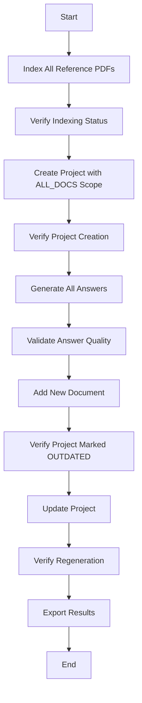

# Testing & Evaluation Plan
## Due Diligence Questionnaire Agent System

---

## 1. Dataset Testing Strategy

### 1.1 Test Dataset Overview

**Location:** `data/` directory in project root

**Files:**
- **Questionnaire:** `ILPA_Due_Diligence_Questionnaire_v1.2.pdf`
- **Reference Documents:**
  - Additional PDFs in `data/` directory
  - Various formats (PDF, DOCX, XLSX, PPTX) for format testing

### 1.2 Dataset Testing Workflow



### 1.3 Detailed Test Steps

#### **Phase 1: Document Indexing**

**Test 1.1: Index Reference Documents**
```bash
# For each PDF in data/ directory
curl -X POST http://localhost:8000/index-document-async \
  -F "file=@data/document1.pdf" \
  -F "metadata={\"source\": \"test_dataset\"}"

# Expected: Returns document_id and request_id
# Status: QUEUED → IN_PROGRESS → COMPLETED
```

**Validation:**
- All documents reach status=COMPLETED
- No parsing errors
- Vector database contains embeddings for all documents
- Both Layer 1 (answer retrieval) and Layer 2 (citation detail) chunks created

**Test 1.2: Verify Multi-Format Support**
```bash
# Test each format
curl -X POST http://localhost:8000/index-document-async \
  -F "file=@data/sample.pdf"
  
curl -X POST http://localhost:8000/index-document-async \
  -F "file=@data/sample.docx"
  
curl -X POST http://localhost:8000/index-document-async \
  -F "file=@data/sample.xlsx"
  
curl -X POST http://localhost:8000/index-document-async \
  -F "file=@data/sample.pptx"
```

**Validation:**
- All formats parse successfully
- Extracted text is meaningful (not garbled)
- Tables from XLSX are properly formatted
- Slides from PPTX have titles preserved

---

#### **Phase 2: Project Creation**

**Test 2.1: Create Project with ALL_DOCS Scope**
```bash
curl -X POST http://localhost:8000/create-project-async \
  -H "Content-Type: application/json" \
  -d '{
    "name": "ILPA Due Diligence Test",
    "questionnaire_document_id": "<questionnaire_doc_id>",
    "document_scope": "ALL_DOCS",
    "configuration": {
      "generation_model": "gpt-4",
      "confidence_threshold": 0.7,
      "max_citations": 5
    }
  }'

# Expected: Returns project_id and request_id
```

**Validation:**
- Project status transitions: CREATING → READY
- All sections from ILPA questionnaire are parsed
- All questions are extracted with correct order
- Answer records created with status=PENDING
- Section hierarchy preserved (I, II, III → A, B, C → 1, 2, 3)

**Test 2.2: Verify Questionnaire Parsing**
```bash
curl -X GET http://localhost:8000/get-project-info/<project_id>
```

**Validation:**
- Total questions count matches expected (based on ILPA questionnaire)
- Section titles are accurate
- Question text is complete (not truncated)
- No duplicate questions

---

#### **Phase 3: Answer Generation**

**Test 3.1: Generate All Answers**
```bash
curl -X POST http://localhost:8000/generate-all-answers \
  -H "Content-Type: application/json" \
  -d '{"project_id": "<project_id>"}'

# Poll status
curl -X GET http://localhost:8000/get-request-status/<request_id>
```

**Validation:**
- All answers reach status=GENERATED or MISSING_DATA
- Progress percentage updates correctly (0% → 100%)
- No timeouts or failures
- Processing time is reasonable (<5 seconds per question on average)

**Test 3.2: Validate Answer Quality**
```bash
# Get sample answers
curl -X GET http://localhost:8000/get-answer/<answer_id>
```

**Validation Criteria:**
- **Answerability:** `is_answerable` correctly indicates if answer is possible
- **Citations:** Each answer has 1-5 citations (if answerable)
- **Confidence Score:** Score is between 0.0-1.0
- **Citation Details:** Each citation includes:
  - document_id
  - page_number
  - excerpt_text (relevant snippet)
  - bounding_box (for PDFs)
- **Answer Quality:** Answers are coherent and relevant to questions
- **No Hallucinations:** All facts in answer are supported by citations

**Test 3.3: Validate Unanswerable Questions**
```bash
# Find questions marked as MISSING_DATA
curl -X GET http://localhost:8000/get-project-info/<project_id>
```

**Validation:**
- Questions with no relevant documents are marked `is_answerable=False`
- Status is MISSING_DATA
- Metadata explains why (e.g., "No relevant documents found")
- No citations are stored

---

#### **Phase 4: ALL_DOCS Invalidation Test**

**Test 4.1: Add New Document**
```bash
# Index a new document
curl -X POST http://localhost:8000/index-document-async \
  -F "file=@data/new_document.pdf"

# Wait for indexing to complete
curl -X GET http://localhost:8000/get-request-status/<request_id>
```

**Test 4.2: Verify Project Status Change**
```bash
# Check project status
curl -X GET http://localhost:8000/get-project-status/<project_id>
```

**Validation:**
- Project status changes from READY → OUTDATED
- Timestamp `updated_at` is updated
- Project remains functional (can still view answers)
- No automatic regeneration (unless configured)

**Test 4.3: Update Project**
```bash
curl -X POST http://localhost:8000/update-project-async \
  -H "Content-Type: application/json" \
  -d '{"project_id": "<project_id>"}'
```

**Validation:**
- Project status: OUTDATED → UPDATING → READY
- CONFIRMED and MANUAL_UPDATED answers are preserved
- GENERATED answers are regenerated
- New citations may reference newly indexed document

---

#### **Phase 5: Review Workflow**

**Test 5.1: Confirm Answer**
```bash
curl -X POST http://localhost:8000/update-answer \
  -H "Content-Type: application/json" \
  -d '{
    "answer_id": "<answer_id>",
    "action": "CONFIRM"
  }'
```

**Validation:**
- Answer status changes to CONFIRMED
- `updated_at` timestamp updated
- Answer remains unchanged during project updates

**Test 5.2: Manual Update**
```bash
curl -X POST http://localhost:8000/update-answer \
  -H "Content-Type: application/json" \
  -d '{
    "answer_id": "<answer_id>",
    "action": "MANUAL_UPDATE",
    "manual_text": "Manually corrected answer text..."
  }'
```

**Validation:**
- Answer status changes to MANUAL_UPDATED
- `manual_text` is stored
- `ai_generated_text` is preserved (for comparison)
- Answer is preserved during project updates

**Test 5.3: Reject Answer**
```bash
curl -X POST http://localhost:8000/update-answer \
  -H "Content-Type: application/json" \
  -d '{
    "answer_id": "<answer_id>",
    "action": "REJECT",
    "reason": "Inaccurate information"
  }'
```

**Validation:**
- Answer status changes to REJECTED
- Rejection reason stored in metadata
- Answer is regenerated during project updates

---

#### **Phase 6: Evaluation**

**Test 6.1: Prepare Ground Truth**
- Create document with human-written answers to ILPA questionnaire
- Match question format and order

**Test 6.2: Run Evaluation**
```bash
curl -X POST http://localhost:8000/evaluate-project \
  -H "Content-Type: application/json" \
  -d '{
    "project_id": "<project_id>",
    "human_answers_document_id": "<ground_truth_doc_id>"
  }'
```

**Test 6.3: Retrieve Evaluation Report**
```bash
curl -X GET http://localhost:8000/get-evaluation/<evaluation_id>
```

**Validation:**
- Overall metrics calculated:
  - semantic_similarity_avg (0.0-1.0)
  - keyword_overlap_avg (0.0-1.0)
  - citation_accuracy (0.0-1.0)
  - overall_score (weighted combination)
- Per-question results include:
  - Semantic similarity score
  - Matched keywords
  - Missing keywords
  - Qualitative explanation
- Report is exportable

---

## 2. QA Checklist

### 2.1 Functional Requirements

#### **Document Ingestion**
- [ ] PDF documents are parsed correctly
- [ ] DOCX documents are parsed correctly
- [ ] XLSX documents are parsed correctly
- [ ] PPTX documents are parsed correctly
- [ ] Scanned PDFs trigger OCR
- [ ] Large files (>50MB) are handled without timeout
- [ ] Corrupted files return meaningful error messages
- [ ] Duplicate documents are allowed but flagged

#### **Multi-Layer Indexing**
- [ ] Layer 1 (answer retrieval) chunks are created
- [ ] Layer 2 (citation detail) chunks are created
- [ ] Embeddings are stored in vector database
- [ ] Bounding boxes are captured for PDFs
- [ ] Chunk metadata includes document_id, page_number, section_title
- [ ] Search returns relevant results for test queries

#### **Questionnaire Parsing**
- [ ] Sections are extracted with correct hierarchy
- [ ] Questions are extracted with correct order
- [ ] Multi-part questions are handled (a, b, c)
- [ ] Questions in tables are extracted
- [ ] Question text is complete (not truncated)
- [ ] Empty questionnaires return error

#### **Project Lifecycle**
- [ ] Projects can be created with ALL_DOCS scope
- [ ] Projects can be created with SELECTED_DOCS scope
- [ ] Project status transitions correctly (CREATING → READY)
- [ ] ALL_DOCS projects are marked OUTDATED when new doc indexed
- [ ] SELECTED_DOCS projects are NOT marked OUTDATED
- [ ] Projects can be updated (OUTDATED → UPDATING → READY)
- [ ] Configuration changes trigger regeneration

#### **Answer Generation**
- [ ] Answers are generated for all questions
- [ ] Answerability is correctly determined
- [ ] Citations are extracted and linked
- [ ] Confidence scores are calculated (0.0-1.0)
- [ ] Unanswerable questions are marked MISSING_DATA
- [ ] Low-confidence answers are flagged
- [ ] Conflicting information is acknowledged in answer

#### **Citations**
- [ ] Each answer has 1-5 citations (if answerable)
- [ ] Citations include document_id, page_number, excerpt
- [ ] Bounding boxes are included for PDFs
- [ ] Citations are relevant to answer content
- [ ] Citations are ranked by relevance

#### **Review Workflow**
- [ ] Answers can be confirmed (GENERATED → CONFIRMED)
- [ ] Answers can be rejected (GENERATED → REJECTED)
- [ ] Answers can be manually edited (GENERATED → MANUAL_UPDATED)
- [ ] Answers can be marked as missing data
- [ ] Manual edits are preserved during project updates
- [ ] Confirmed answers are preserved during project updates
- [ ] AI answers are preserved alongside manual edits

#### **Evaluation**
- [ ] Semantic similarity is calculated correctly
- [ ] Keyword overlap is calculated correctly
- [ ] Citation accuracy is evaluated
- [ ] Overall score is computed
- [ ] Per-question explanations are generated
- [ ] Matched/missing keywords are identified
- [ ] Evaluation report is exportable

---

### 2.2 Non-Functional Requirements

#### **Performance**
- [ ] Document indexing completes in <5 minutes for 10MB PDF
- [ ] Answer generation takes <5 seconds per question (average)
- [ ] Project creation completes in <2 minutes for 100-question questionnaire
- [ ] API response time <500ms for GET requests
- [ ] Vector search returns results in <1 second

#### **Scalability**
- [ ] System handles 100+ documents
- [ ] System handles 500+ question projects
- [ ] Background workers can be scaled horizontally
- [ ] Database queries are optimized (indexed)
- [ ] Vector database supports sharding

#### **Reliability**
- [ ] Failed async requests can be retried
- [ ] LLM API failures trigger retry with backoff
- [ ] Database connection failures are handled gracefully
- [ ] Partial failures don't corrupt project state
- [ ] All operations are idempotent where possible

#### **Security**
- [ ] File uploads are validated (type, size)
- [ ] Input is sanitized (SQL injection prevention)
- [ ] API endpoints require authentication
- [ ] Users can only access their own projects
- [ ] Sensitive data is encrypted at rest

#### **Observability**
- [ ] All API requests are logged
- [ ] Async request status is trackable
- [ ] Errors include detailed messages
- [ ] Metrics are collected (latency, success rate)
- [ ] Alerts are configured for failures

---

## 3. Evaluation Metrics

### 3.1 Answer Quality Metrics

#### **Semantic Similarity**
**Formula:** Cosine similarity of sentence embeddings

**Interpretation:**
- **0.9-1.0:** Excellent - AI answer nearly identical to human
- **0.7-0.9:** Good - AI captures main points
- **0.5-0.7:** Fair - AI partially correct
- **<0.5:** Poor - AI answer significantly different

**Target:** Average semantic similarity > 0.75

---

#### **Keyword Overlap**
**Formula:** Jaccard similarity of extracted keywords

**Interpretation:**
- **0.8-1.0:** Excellent - Most key terms present
- **0.6-0.8:** Good - Major terms present
- **0.4-0.6:** Fair - Some terms missing
- **<0.4:** Poor - Many important terms missing

**Target:** Average keyword overlap > 0.65

---

#### **Citation Accuracy**
**Formula:** % of citations that contain information in human answer

**Interpretation:**
- **0.9-1.0:** Excellent - All citations are relevant
- **0.7-0.9:** Good - Most citations are relevant
- **0.5-0.7:** Fair - Some citations are irrelevant
- **<0.5:** Poor - Many citations are incorrect

**Target:** Citation accuracy > 0.80

---

#### **Confidence Calibration**
**Metric:** Correlation between confidence score and actual accuracy

**Measurement:**
- Group answers by confidence buckets (0-0.3, 0.3-0.6, 0.6-0.8, 0.8-1.0)
- Calculate average semantic similarity for each bucket
- High confidence should correlate with high similarity

**Target:** Correlation coefficient > 0.7

---

### 3.2 System Performance Metrics

#### **Indexing Throughput**
- **Metric:** Documents indexed per hour
- **Target:** >10 documents/hour (for 10MB PDFs)

#### **Answer Generation Latency**
- **Metric:** Average time per answer
- **Target:** <5 seconds (p95 <10 seconds)

#### **API Availability**
- **Metric:** Uptime percentage
- **Target:** >99.5%

#### **Error Rate**
- **Metric:** % of requests that fail
- **Target:** <1%

---

### 3.3 User Experience Metrics

#### **Review Efficiency**
- **Metric:** % of answers confirmed without edits
- **Target:** >70% (indicates high AI quality)

#### **Manual Override Rate**
- **Metric:** % of answers manually edited
- **Target:** <20% (indicates AI is mostly correct)

#### **Missing Data Rate**
- **Metric:** % of questions marked unanswerable
- **Target:** <10% (indicates good document coverage)

---

## 4. Acceptance Criteria Validation

### A. Documentation Completeness ✅

**Criterion:** Document includes all 8 scope areas

**Validation:**
- [x] Product & Data Model Alignment - Covered in Architecture Design
- [x] Document Ingestion & Indexing - Covered in Architecture Design
- [x] Questionnaire Parsing & Project Lifecycle - Covered in Architecture Design
- [x] Answer Generation with Citations & Confidence - Covered in Architecture Design
- [x] Review & Manual Overrides - Covered in Architecture Design
- [x] Evaluation Framework - Covered in Architecture Design
- [x] Optional Chat Extension - Covered in Architecture Design
- [x] Frontend Experience - Covered in Architecture Design

**Criterion:** Every API endpoint is explained in context

**Validation:**
- [x] POST /create-project-async - Functional Design §2.2
- [x] POST /update-project-async - Functional Design §2.6
- [x] POST /generate-single-answer - Functional Design §2.4
- [x] POST /generate-all-answers - Functional Design §2.3
- [x] POST /update-answer - Functional Design §2.5
- [x] GET /get-project-info - Functional Design §2.7
- [x] GET /get-project-status - Functional Design (implied)
- [x] POST /index-document-async - Functional Design §2.1
- [x] GET /get-request-status - Functional Design §2.8

**Criterion:** Data structures mapped to system design

**Validation:**
- [x] Document entity - Architecture Design §1.3
- [x] Project entity - Architecture Design §1.3
- [x] Section entity - Architecture Design §1.3
- [x] Question entity - Architecture Design §1.3
- [x] Answer entity - Architecture Design §1.3
- [x] Citation entity - Architecture Design §1.3
- [x] IndexChunk entity - Architecture Design §1.3
- [x] AsyncRequest entity - Architecture Design §1.3
- [x] Evaluation entities - Architecture Design §1.3

---

### B. Functional Accuracy ✅

**Criterion:** Workflow shows complete pipeline

**Validation:**
- [x] Upload documents - Functional Design §1.2
- [x] Index documents - Architecture Design §2.3
- [x] Create project - Functional Design §1.3
- [x] Generate answers - Functional Design §1.4
- [x] Review answers - Functional Design §1.5
- [x] Evaluation - Functional Design §1.7

**Criterion:** Answers include required components

**Validation:**
- [x] Answerability statement - Architecture Design §4.2, §4.3
- [x] Citations - Architecture Design §4.2, Step 5
- [x] Confidence score - Architecture Design §4.2, Step 6

**Criterion:** ALL_DOCS projects become OUTDATED

**Validation:**
- [x] Invalidation logic - Architecture Design §2.4
- [x] Status transition - Functional Design §3.1
- [x] Test case - Testing Plan §1.3, Phase 4

---

### C. Review & Auditability ✅

**Criterion:** Manual edits preserved alongside AI results

**Validation:**
- [x] Dual storage - Architecture Design §5.3
- [x] Answer entity schema - Architecture Design §1.3
- [x] Manual update workflow - Functional Design §1.5

**Criterion:** Answer status transitions described

**Validation:**
- [x] State machine - Functional Design §3.2
- [x] Transition rules - Functional Design §3.2
- [x] Preservation rules - Functional Design §3.2

---

### D. Evaluation Framework ✅

**Criterion:** Clear comparison method

**Validation:**
- [x] Semantic similarity - Architecture Design §6.2
- [x] Keyword overlap - Architecture Design §6.2
- [x] Citation accuracy - Architecture Design §6.2
- [x] Qualitative explanation - Architecture Design §6.5

**Criterion:** Output includes numeric score and explanation

**Validation:**
- [x] Overall score - Architecture Design §6.3
- [x] Per-question scores - Architecture Design §6.3
- [x] LLM-generated explanations - Architecture Design §6.5

---

### E. Non-Functional Requirements ✅

**Criterion:** Async processing described

**Validation:**
- [x] AsyncRequest entity - Architecture Design §1.3
- [x] Background workers - Architecture Design, Component Boundaries
- [x] Status tracking - Functional Design §2.8
- [x] Workflow diagrams - Functional Design §1.2-1.7

**Criterion:** Error handling described

**Validation:**
- [x] Document parsing errors - Functional Design §4.1
- [x] Questionnaire parsing errors - Functional Design §4.2
- [x] Answer generation errors - Functional Design §4.3
- [x] System-level errors - Functional Design §4.7
- [x] Missing data fallback - Architecture Design §4.3

**Criterion:** Regeneration logic described

**Validation:**
- [x] Project update workflow - Functional Design §1.6
- [x] Update logic - Architecture Design §3.3
- [x] Preservation rules - Functional Design §3.2

---

### F. Frontend UX ✅

**Criterion:** All core workflows described

**Validation:**
- [x] Create/update project - Architecture Design §8.2, Workflow 1
- [x] Review answers - Architecture Design §8.2, Workflow 2
- [x] Track background status - Architecture Design §8.2, Workflow 3
- [x] Compare AI vs human - Architecture Design §8.2, Workflow 4

**Criterion:** All screens described

**Validation:**
- [x] Project List - Architecture Design §8.1, Screen 1
- [x] Project Detail - Architecture Design §8.1, Screen 2
- [x] Question Review - Architecture Design §8.1, Screen 3
- [x] Document Management - Architecture Design §8.1, Screen 4
- [x] Evaluation Report - Architecture Design §8.1, Screen 5
- [x] Request Status - Architecture Design §8.1, Screen 6

---

## 5. Test Execution Plan

### 5.1 Testing Phases

**Phase 1: Unit Testing (Backend)**
- Test individual functions (parsing, chunking, embedding)
- Test database models and queries
- Test API endpoint handlers
- **Duration:** 1 week
- **Coverage Target:** >80%

**Phase 2: Integration Testing**
- Test complete workflows (upload → index → generate)
- Test async processing and status tracking
- Test error handling and recovery
- **Duration:** 1 week

**Phase 3: Dataset Testing**
- Execute all tests in §1.3 using ILPA questionnaire
- Validate answer quality manually
- Run evaluation against ground truth
- **Duration:** 3 days

**Phase 4: Performance Testing**
- Load test with 100+ documents
- Stress test with 500+ questions
- Measure latency and throughput
- **Duration:** 2 days

**Phase 5: User Acceptance Testing**
- Frontend testing with real users
- Usability testing of review workflow
- Feedback collection and iteration
- **Duration:** 1 week

---

### 5.2 Success Criteria

**Must Pass:**
- All functional requirements in QA checklist
- Dataset testing completes without errors
- ALL_DOCS invalidation works correctly
- Answer quality metrics meet targets
- All acceptance criteria validated

**Nice to Have:**
- Performance metrics exceed targets
- User satisfaction score >4/5
- Manual override rate <15%

---

## 6. Continuous Evaluation

### 6.1 Ongoing Monitoring

**Daily:**
- Error rate monitoring
- API latency tracking
- Background job completion rate

**Weekly:**
- Answer quality sampling (10 random answers)
- Confidence calibration check
- User feedback review

**Monthly:**
- Full evaluation run with updated ground truth
- Performance benchmarking
- Feature usage analytics

---

### 6.2 Improvement Triggers

**Trigger 1: Semantic Similarity <0.70**
- Action: Review retrieval strategy
- Consider: Better chunking, improved embeddings

**Trigger 2: Manual Override Rate >25%**
- Action: Analyze common edit patterns
- Consider: Fine-tune generation prompts

**Trigger 3: Missing Data Rate >15%**
- Action: Review document coverage
- Consider: Add more reference documents

**Trigger 4: Error Rate >2%**
- Action: Investigate root causes
- Consider: Improve error handling

---

## Summary

This testing and evaluation plan provides:

✅ **Comprehensive dataset testing:** Step-by-step validation using ILPA questionnaire  
✅ **Detailed QA checklist:** Functional and non-functional requirements  
✅ **Quantitative metrics:** Semantic similarity, keyword overlap, citation accuracy  
✅ **Acceptance criteria validation:** All 6 criteria (A-F) mapped to documentation  
✅ **Test execution plan:** Phased approach with clear success criteria  
✅ **Continuous monitoring:** Ongoing evaluation and improvement triggers

The plan ensures the system meets all requirements and maintains high quality over time.
